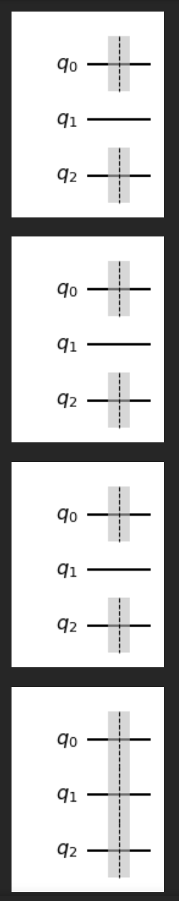

## 

Sie werden die Barriere nicht in Lehrbüchern über Quanteninformatik finden, 
da sie kein Standardprimitiv der Quanteninformationstheorie ist, wie etwa unitäre Gatter und Quantenschaltungen.

Die Barriere dient als Richtlinie für die Kompilierung von Schaltkreisen, 
um Teile eines Schaltkreises zu trennen, so dass Optimierungen oder Neuschreibungen nur zwischen den Barrieren wirken 
(und wenn es keine Barrieren gibt, wirken sie auf den gesamten Schaltkreis). 
Dies kommt nur ins Spiel, wenn Sie die Funktionen Transpilieren oder Ausführen in Qiskit verwenden 
(Ausführen beinhaltet einen Transpilierschritt).

Unten finden Sie ein Beispiel, weitere Beispiele finden Sie in den Qiskit-Tutorials:

Beispiel

Wenn eine Schaltung mehrere 1-Qubit-Gatter in einer Reihe hat, 
die auf dasselbe Qubit wirken, können diese zu einem einzigen 1-Qubit-Gatter zusammengefasst werden. 
Wenn Sie dieses Verhalten explizit verhindern wollen, können Sie eine Barriere dazwischen setzen.

Erstellen Sie eine 1-Qubit-Schaltung mit mehreren Gattern

# Import Basic Functions First

	import qiskit
	from qiskit import ClassicalRegister, QuantumRegister, QuantumCircuit
	from qiskit import execute, BasicAer, Aer
	from qiskit.tools.visualization import plot_histogram, circuit_drawer

	from qiskit.visualization import plot_state_qsphere
	from qiskit.visualization import plot_bloch_multivector, array_to_latex
	from numpy import sqrt, pi

Create Barriers

Erläuterung zu Barriers. 
Wenn eine Schaltung mehrere 1-Qubit-Gates in einer Reihe hat, die auf dasselbe Qubit wirken, 
können diese zu einem einzigen 1-Qubit-Gate zusammengefasst werden.
Wenn Sie dieses Verhalten explizit verhindern wollen, können Sie eine Barriere dazwischen setzen.

Neue Barriere-Anweisung erstellen.

# Beispiel
# 3 Möglichkeiten - gleiches Ergebnis

	qc = QuantumCircuit(3)
	qc.barrier(0)
	qc.barrier(2)
	display(qc.draw('mpl'))

	qc = QuantumCircuit(3)
	qc.barrier([0,2])
	display(qc.draw('mpl'))

	qc = QuantumCircuit(3)
	qc.barrier(0,2)
	display(qc.draw('mpl'))

	qc = QuantumCircuit(3)
	qc.barrier()
	display(qc.draw('mpl'))

