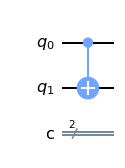
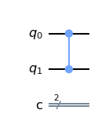
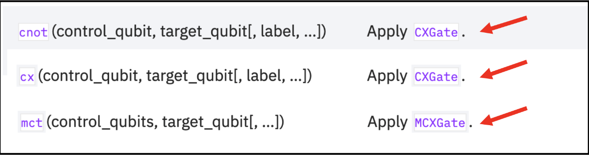
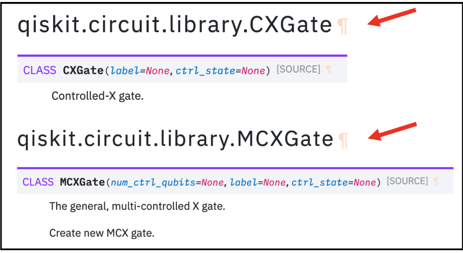

```python
import numpy as np

# Importing standard Qiskit libraries
from qiskit import QuantumCircuit, transpile, Aer, IBMQ
from qiskit.tools.jupyter import *
from qiskit.visualization import *
from ibm_quantum_widgets import *
from qiskit.providers.aer import QasmSimulator

# Loading your IBM Quantum account(s)
provider = IBMQ.load_account()
```

    <frozen importlib._bootstrap>:219: RuntimeWarning: scipy._lib.messagestream.MessageStream size changed, may indicate binary incompatibility. Expected 56 from C header, got 64 from PyObject


Import Basic Functions First


```python
import qiskit
from qiskit import ClassicalRegister, QuantumRegister, QuantumCircuit
from qiskit import execute, BasicAer, Aer
from qiskit.tools.visualization import plot_histogram, circuit_drawer

from qiskit.visualization import plot_state_qsphere
from qiskit.visualization import plot_bloch_multivector, array_to_latex
from numpy import sqrt, pi
```

https://slides.com/javafxpert/prep-qiskit-dev-cert-exam#/21


```python

```


### Solution
    https://qiskit.org/documentation/stubs/qiskit.circuit.QuantumCircuit.html


qc.measure ([0,1,2],[0,1,2])


### Multiple Qubits and Entangled States

https://qiskit.org/textbook/ch-gates/multiple-qubits-entangled-states.html

## Multi-Qubit Gates

### Ein wichtiges Zwei-Qubit-Gate ist das CNOT-Gate 

Dieses Gatter ist ein bedingtes (conditional) Gate, das ein X-Gate auf dem zweiten Qubit (Ziel) ausführt, wenn der Zustand des ersten Qubits (Kontrolle) ist |1⟩ 
Das Gate wird auf einer Schaltung wie dieser gezeichnet, mit q0 als Steuerung (control) und q1 als Ziel (target):


```python
qc = QuantumCircuit(2)
# Apply CNOT
qc.cx(0,1)
# See the circuit:
qc.draw()
```


    

    


```python
# put qubit in Superposition |+) 
qc = QuantumCircuit(2)
# Apply H-gate to the first:
qc.h(0)
qc.draw()
```


    

    


```python
# And let’s see what happens when we apply the CNOT gate:
qc = QuantumCircuit(2)
# Apply H-gate to the first:
qc.h(0)
# Apply a CNOT:
qc.cx(0,1)
qc.draw()
```


    

    


```python
# Let's see the result:
from qiskit import QuantumCircuit, Aer, assemble
svsim = Aer.get_backend('aer_simulator')
qc.save_statevector()
qobj = assemble(qc)
final_state = svsim.run(qobj).result().get_statevector()
# Print the statevector neatly:
array_to_latex(final_state, prefix="\\text{Statevector = }")
```


$$
\text{Statevector = }
\begin{bmatrix}
\tfrac{1}{\sqrt{2}} & 0 & 0 & \tfrac{1}{\sqrt{2}}  \\
 \end{bmatrix}
$$


# sample question #9


### Familiarity with Qiskit API, multi-qubit gates


9. Which code fragment will produce a multi-qubit gate other than a CNOT ?

    A. qc.cx(0,1)
    
    B. qc.cnot(0,1)
    
    C. qc.mct([0],1)
    
    D. qc.cz(0,1)


```python
qc = QuantumCircuit (2,2)
qc.cx(0,1)
qc.draw()
```


    

    


```python
qc = QuantumCircuit (2,2)
qc.cnot(0,1)
qc.draw()
```


    

    


```python
qc = QuantumCircuit (2,2)
qc.mct([0],1)
qc.draw()
```


    

    


```python
qc = QuantumCircuit (2,2)
qc.cz(0,1)
qc.draw()
```


    

    


### Solution


    https://qiskit.org/documentation/stubs/qiskit.circuit.QuantumCircuit.html





    qc.cz(0,1)
