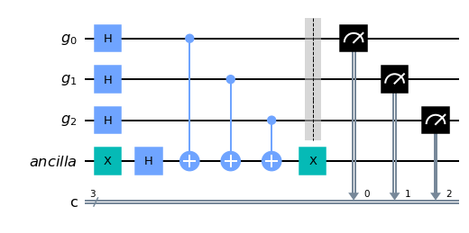
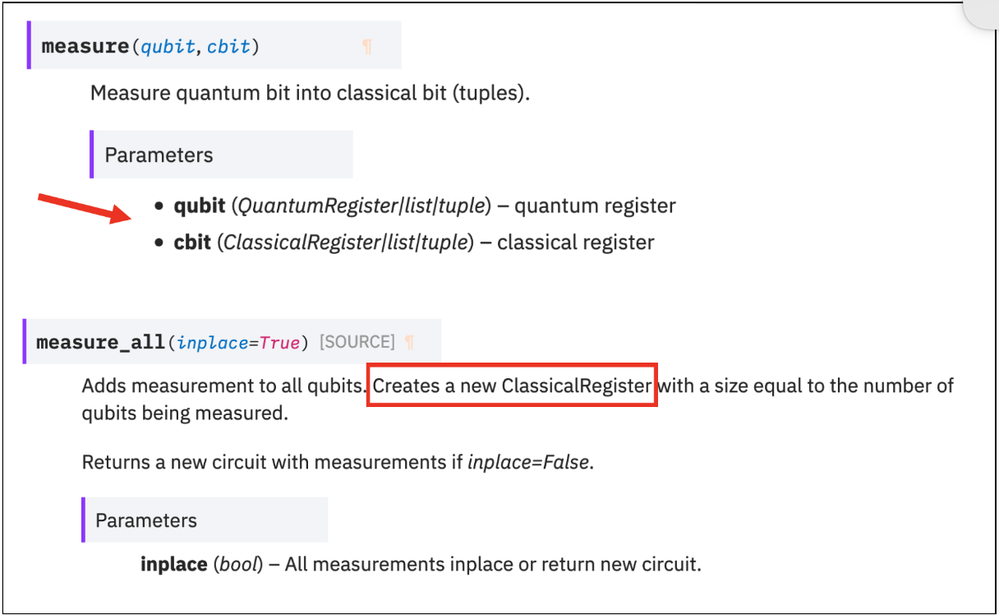
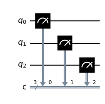
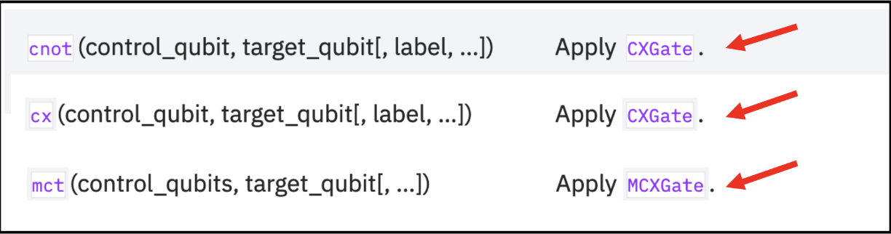
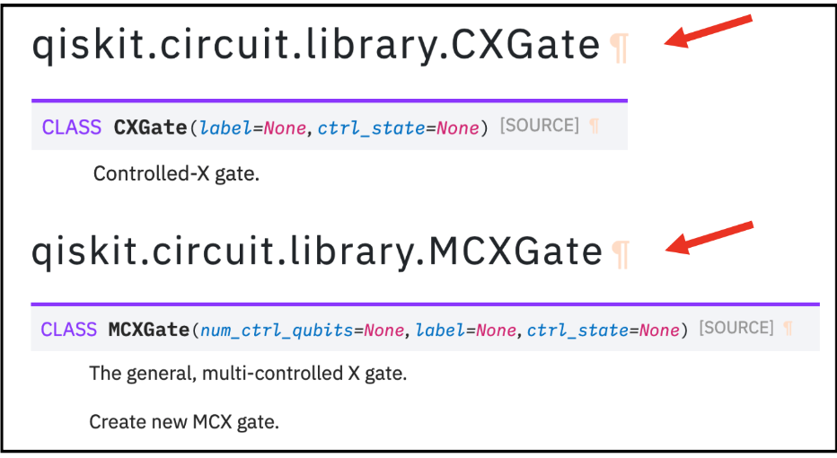

<details open>

<summary>Import Basic Functions First</summary>

    import numpy as np

    # Importing standard Qiskit libraries
    from qiskit import QuantumCircuit, transpile, Aer, IBMQ
    from qiskit.tools.jupyter import *
    from qiskit.visualization import *
    from ibm_quantum_widgets import *
    from qiskit.providers.aer import QasmSimulator

    # Loading your IBM Quantum account(s)
    provider = IBMQ.load_account()
    
    import qiskit
    from qiskit import ClassicalRegister, QuantumRegister, QuantumCircuit
    from qiskit import execute, BasicAer, Aer
    from qiskit.tools.visualization import plot_histogram, circuit_drawer

    from qiskit.visualization import plot_state_qsphere
    from qiskit.visualization import plot_bloch_multivector, array_to_latex
    from numpy import sqrt, pi

</details>

# Qiskit API


Sample Questions can be found here: 

https://slides.com/javafxpert/prep-qiskit-dev-cert-exam#


## Question #9 : Familiarity with Qiskit API, multi-qubit gates

[Sample Question 9:  Multi Qubit Gates ](../prep-API-Questions-9-Multi-Qubit-Gates/prep-API-Questions-9-Multi-Qubit-Gates.md)


### Which statement will create a quantum circuit with four quantum bits and four classical bits?

A. QuantumCircuit (4,4)

B. QuantumCircuit (4)

С. QuantumCircuit (QuantumRegister (4, 'grO'),QuantumRegister (4, 'crI'))

D. QuantumCircuit ([4,4])


```python
qc = QuantumCircuit (4,4)
#QuantumCircuit (4)
#QuantumCircuit (QuantumRegister (4, 'grO'),QuantumRegister (4, 'crI'))
#QuantumCircuit ([4, 4])
qc.draw()
```


    

    


QuantumCircuit (4, 3) 

Ein QuantumCircuit mit 4 qubits und 3 klassischen Bits


https://qiskit.org/documentation/stubs/qiskit.circuit.QuantumCircuit.html

## Assuming the fragment below, which three code fragments would produce the circuit illustrated ?

inp reg = QuantumRegister (2, name='inp")

ancilla = QuantumRegister (1, name='anc')

qo = QuantumCircuit (in reg, ancilla)

# Insert code here


A. go.h (inp reg)
qc.× (ancilla)
qc.draw ()

B. gc.h(inp reg [0:2])
qc.x(ancilla [0])
qc.draw ()

C. qc.h(inp reg [0:1])
qc.x (ancilla [0])
qc.draw ( )

D. go.h (inp reg [0]) qc.h (inp reg [1])
qc.× (ancilla 01)
qc.draw ()

E. qc.h(inp reg [1]) qc.h(inp reg [2])
qc.×(ancilla [1])
qc.draw ()

F. qc.h (inp reg) qc.h(inp reg)
qc.x (ancilla)
ac.draw ()


https://qiskit.org/documentation/stubs/qiskit.circuit.QuantumRegister.html


```python
from qiskit import QuantumRegister, ClassicalRegister, QuantumCircuit
qr = QuantumRegister (3,'g')
anc = QuantumRegister(1, 'ancilla')
cr = ClassicalRegister (3, 'c')
qc = QuantumCircuit (qr, anc, cr)
qc.x (anc [0])
qc.h (anc [0])
qc.h(qr [0:3])
qc.cx(qr[0:3], anc[0])
qc.x (anc [0])
qc.barrier (qr)
#qc = QuantumCircuit (qr, anc, cI)
qc.measure (qr,cr)
qc.draw ()
```


    

    


### Lösung:

A. 
    go.h (inp reg) qc.× (ancilla) qc.draw ()

B. 
    gc.h(inp reg [0:2]) qc.x(ancilla [0]) qc.draw ()

D. 
    go.h (inp reg [0]) qc.h (inp reg [1]) qc.× (ancilla 01) qc.draw ()


```python

```

## measure vs. measure_all
### 4. Given an empty QuantumCircuit object, q, with three qubits and three classical bits, which one of these code fragments would create this circuit?

    A. qc.measure ( [0,1,2], [0,1,2])
    B. qc.measure ([0,0], [1,1], [2,2] )
    C. qc.measure.all ()
    D. qc.measure (0,1,2 )


### Solution
    https://qiskit.org/documentation/stubs/qiskit.circuit.QuantumCircuit.html



qc.measure ([0,1,2],[0,1,2])


```python
qc = QuantumCircuit (3,3)
qc.measure([0,1,2],[0,1,2])
qc.draw()
```


    

    


```python
# put qubit in Superposition |+) 
qc = QuantumCircuit(2)
# Apply H-gate to the first:
qc.h(0)
qc.draw()
```


    

    


```python
# Let's see the result:
from qiskit import QuantumCircuit, Aer, assemble
svsim = Aer.get_backend('aer_simulator')
qc.save_statevector()
qobj = assemble(qc)
final_state = svsim.run(qobj).result().get_statevector()
# Print the statevector neatly:
array_to_latex(final_state, prefix="\\text{Statevector = }")
```


$$
\text{Statevector = }
\begin{bmatrix}
\tfrac{1}{\sqrt{2}} & \tfrac{1}{\sqrt{2}} & 0 & 0  \\
 \end{bmatrix}
$$


```python
# And let’s see what happens when we apply the CNOT gate:
qc = QuantumCircuit(2)
# Apply H-gate to the first:
qc.h(0)
# Apply a CNOT:
qc.cx(0,1)
qc.draw()
```


    

    


### Solution


    https://qiskit.org/documentation/stubs/qiskit.circuit.QuantumCircuit.html





    qc.cz(0,1)


```python
qc = QuantumCircuit (2,2)
qc.cx(0,1)
qc.draw()
```


```python
qc = QuantumCircuit (2,2)
qc.cnot(0,1)
qc.draw()
```


```python
qc = QuantumCircuit (2,2)
qc.mct([0],1)
qc.draw()
```


```python
qc = QuantumCircuit (2,2)
qc.cz(0,1)
qc.draw()
```


# sample question #10


### Familiarity with Qiskit API, Toffoli gate


```python

10. Which code fragment will produce a multi-qubit gate other than a Toffoli?


```
