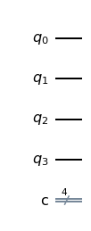
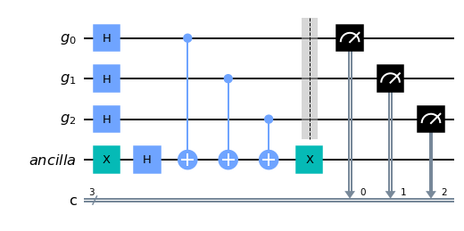

```python
import numpy as np

# Importing standard Qiskit libraries
from qiskit import QuantumCircuit, transpile, Aer, IBMQ
from qiskit.tools.jupyter import *
from qiskit.visualization import *
from ibm_quantum_widgets import *
from qiskit.providers.aer import QasmSimulator

# Loading your IBM Quantum account(s)
provider = IBMQ.load_account()
```

    ibmqfactory.load_account:WARNING:2023-03-06 17:12:31,838: Credentials are already in use. The existing account in the session will be replaced.


Import Basic Functions First


```python
import qiskit
from qiskit import ClassicalRegister, QuantumRegister, QuantumCircuit
from qiskit import execute, BasicAer, Aer
from qiskit.tools.visualization import plot_histogram, circuit_drawer

from qiskit.visualization import plot_state_qsphere
from qiskit.visualization import plot_bloch_multivector, array_to_latex
from numpy import sqrt, pi
```

https://slides.com/javafxpert/prep-qiskit-dev-cert-exam#/21

## Qiskit API

Sample Questions can be found here: 
https://slides.com/javafxpert/prep-qiskit-dev-cert-exam#/21


### Which statement will create a quantum circuit with four quantum bits and four classical bits?

A. QuantumCircuit (4,4)

B. QuantumCircuit (4)

С. QuantumCircuit (QuantumRegister (4, 'grO'),QuantumRegister (4, 'crI'))

D. QuantumCircuit ([4,4])


```python
qc = QuantumCircuit (4,4)
#QuantumCircuit (4)
#QuantumCircuit (QuantumRegister (4, 'grO'),QuantumRegister (4, 'crI'))
#QuantumCircuit ([4, 4])
qc.draw()
```


    

    


QuantumCircuit (4, 3) 

Ein QuantumCircuit mit 4 qubits und 3 klassischen Bits


https://qiskit.org/documentation/stubs/qiskit.circuit.QuantumCircuit.html

## Assuming the fragment below, which three code fragments would produce the circuit illustrated ?

inp reg = QuantumRegister (2, name='inp")

ancilla = QuantumRegister (1, name='anc')

qo = QuantumCircuit (in reg, ancilla)

# Insert code here


A. go.h (inp reg)
qc.× (ancilla)
qc.draw ()

B. gc.h(inp reg [0:2])
qc.x(ancilla [0])
qc.draw ()

C. qc.h(inp reg [0:1])
qc.x (ancilla [0])
qc.draw ( )

D. go.h (inp reg [0]) qc.h (inp reg [1])
qc.× (ancilla 01)
qc.draw ()

E. qc.h(inp reg [1]) qc.h(inp reg [2])
qc.×(ancilla [1])
qc.draw ()

F. qc.h (inp reg) qc.h(inp reg)
qc.x (ancilla)
ac.draw ()


https://qiskit.org/documentation/stubs/qiskit.circuit.QuantumRegister.html


```python
from qiskit import QuantumRegister, ClassicalRegister, QuantumCircuit
qr = QuantumRegister (3,'g')
anc = QuantumRegister(1, 'ancilla')
cr = ClassicalRegister (3, 'c')
qc = QuantumCircuit (qr, anc, cr)
qc.x (anc [0])
qc.h (anc [0])
qc.h(qr [0:3])
qc.cx(qr[0:3], anc[0])
qc.x (anc [0])
qc.barrier (qr)
#qc = QuantumCircuit (qr, anc, cI)
qc.measure (qr,cr)
qc.draw ()
```


    

    


### Lösung:

A. 
    go.h (inp reg) qc.× (ancilla) qc.draw ()

B. 
    gc.h(inp reg [0:2]) qc.x(ancilla [0]) qc.draw ()

D. 
    go.h (inp reg [0]) qc.h (inp reg [1]) qc.× (ancilla 01) qc.draw ()


```python

```


```python

```


```python

```


```python

```
