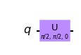
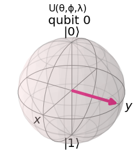
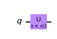
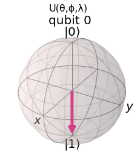

### [zurück zum Index](../index.md)

```python
import numpy as np

# Importing standard Qiskit libraries
from qiskit import QuantumCircuit, transpile, Aer, IBMQ
from qiskit.tools.jupyter import *
from qiskit.visualization import *
from ibm_quantum_widgets import *
from qiskit.providers.aer import QasmSimulator

# Loading your IBM Quantum account(s)
provider = IBMQ.load_account()
```

    <frozen importlib._bootstrap>:219: RuntimeWarning: scipy._lib.messagestream.MessageStream size changed, may indicate binary incompatibility. Expected 56 from C header, got 64 from PyObject


### Basisfunktionen importieren:


```python
import qiskit
from qiskit import ClassicalRegister, QuantumRegister, QuantumCircuit
from qiskit import execute, BasicAer, Aer
from qiskit.tools.visualization import plot_histogram, circuit_drawer

from qiskit.visualization import plot_state_qsphere
from qiskit.visualization import plot_bloch_multivector, array_to_latex
from numpy import sqrt, pi
```

### Welche Qiskit Versionen sind auf dem System installiert ?


```python
versions = qiskit.__qiskit_version__
print('Qiskit components and versions:')
print('===============================')
for i in versions:
    print(i,versions[i])
```

    Qiskit components and versions:
    ===============================
    qiskit-terra 0.22.2
    qiskit-aer 0.11.1
    qiskit-ignis None
    qiskit-ibmq-provider 0.19.2
    qiskit 0.39.2
    qiskit-nature 0.5.0
    qiskit-finance 0.3.4
    qiskit-optimization 0.4.0
    qiskit-machine-learning 0.5.0


### The U-Gate

Das U-Gate ist ein Gate, das eine Drehung um die Bloch-Kugel mit 3 Euler-Winkeln durchführt. Die drei Winkel, die zur Durchführung der Drehungen verwendet werden, sind θ, λ und φ. 

Die Funktionsweise des U-Gatters kann mit der folgenden Matrix beschrieben werden:

    Bases: qiskit.circuit.gate.Gate

Generic single-qubit rotation gate with 3 Euler angles.

    q_0: ┤ U(ϴ,φ,λ) ├

Das U-Gate kann jedes andere Ein-Qubit-Gate replizieren. 
Um zum Beispiel das Pauli-X-Gate zu replizieren, würde man θ um π, φ um π und λ um π/2 drehen:

Where U(π, π, π/2 ) = U(θ, φ, λ)


```python
qc = QuantumCircuit(1)
qc.u(pi/2,pi/2,0,0)
display(qc.draw('mpl'))

print('Every single-qubit gate can be specified as U(θ,ϕ,λ)') 
```


    

    


    Every single-qubit gate can be specified as U(θ,ϕ,λ)


```python
backend = BasicAer.get_backend('statevector_simulator')
job = execute(qc, backend).result()
plot_bloch_multivector(job.get_statevector(qc), title='U(θ,ϕ,λ)')
```


    

    


Nehmen wir zum Beispiel an, wir wollen ein Pauli-X-Gate mit dem U-Gate replizieren. Dann müssen wir theta und phi auf π und lambda auf π/2 setzen, etwa so: 


```python
qc = QuantumCircuit(1)
qc.u(pi, pi, pi/2,0)
display(qc.draw('mpl'))
print('Every single-qubit gate can be specified as U(θ,ϕ,λ)') 
```


    

    


    Every single-qubit gate can be specified as U(θ,ϕ,λ)


```python
backend = BasicAer.get_backend('statevector_simulator')
job = execute(qc, backend).result()
plot_bloch_multivector(job.get_statevector(qc), title='U(θ,ϕ,λ)')
```


    

    


```python

```
