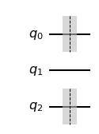
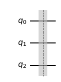

```python
import numpy as np

# Importing standard Qiskit libraries
from qiskit import QuantumCircuit, transpile, Aer, IBMQ
from qiskit.tools.jupyter import *
from qiskit.visualization import *
from ibm_quantum_widgets import *
from qiskit.providers.aer import QasmSimulator

# Loading your IBM Quantum account(s)
provider = IBMQ.load_account()
```

    <frozen importlib._bootstrap>:219: RuntimeWarning: scipy._lib.messagestream.MessageStream size changed, may indicate binary incompatibility. Expected 56 from C header, got 64 from PyObject


Import Basic Functions First


```python
import qiskit
from qiskit import ClassicalRegister, QuantumRegister, QuantumCircuit
from qiskit import execute, BasicAer, Aer
from qiskit.tools.visualization import plot_histogram, circuit_drawer

from qiskit.visualization import plot_state_qsphere
from qiskit.visualization import plot_bloch_multivector, array_to_latex
from numpy import sqrt, pi
```

Create Barriers

Erläuterung zu Barriers. 
Eine Barriere ist ein visueller Indikator für die Gruppierung eines Schaltungsabschnitts. Sie dient auch als Richtlinie für die Schaltkreiskompilierung, um Teile eines Schaltkreises zu trennen, so dass Optimierungen oder Neuschreibungen nur zwischen den Barrieren stattfinden können. 
Neue Barriere-Anweisung erstellen.

Beispiel

Wenn eine Schaltung mehrere 1-Qubit-Gates in einer Reihe hat, die auf dasselbe Qubit wirken, können diese zu einem einzigen 1-Qubit-Gate zusammengefasst werden. Wenn Sie dieses Verhalten explizit verhindern wollen, können Sie eine Barriere dazwischen setzen.


```python
qc = QuantumCircuit(3)
qc.barrier(0)
qc.barrier(2)
display(qc.draw('mpl'))

qc = QuantumCircuit(3)
qc.barrier([0,2])
display(qc.draw('mpl'))

qc = QuantumCircuit(3)
qc.barrier(0,2)
display(qc.draw('mpl'))


qc = QuantumCircuit(3)
qc.barrier()
display(qc.draw('mpl'))
```


    

    


    

    


    

    


    

    


```python


```


```python


```


```python

```
