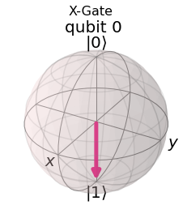
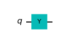
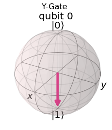
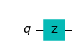
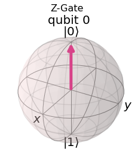
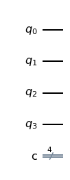

#### [zurück zum Index](../../index.md)

# Quantum States und Qubits

## Single Qubit Gates


```python
import numpy as np

# Importing standard Qiskit libraries
from qiskit import QuantumCircuit, transpile, Aer, IBMQ
from qiskit.tools.jupyter import *
from qiskit.visualization import *
from ibm_quantum_widgets import *
from qiskit.providers.aer import QasmSimulator

# Loading your IBM Quantum account(s)
provider = IBMQ.load_account()
```

    ibmqfactory.load_account:WARNING:2023-03-06 17:12:31,838: Credentials are already in use. The existing account in the session will be replaced.


Import Basic Functions First


```python
import qiskit
from qiskit import ClassicalRegister, QuantumRegister, QuantumCircuit
from qiskit import execute, BasicAer, Aer
from qiskit.tools.visualization import plot_histogram, circuit_drawer

from qiskit.visualization import plot_state_qsphere
from qiskit.visualization import plot_bloch_multivector, array_to_latex
from numpy import sqrt, pi
```


### Das X-Gate

Das Pauli-X-Gatter ist eine Ein-Qubit-Drehung durch π Radiant um die x-Achse.

X|0> = |1>
X|1> = |0>
 

#### Let's do an X-gate on a qubit 0:  |0> qubit


```python

```


```python
qc = QuantumCircuit(1)
qc.x(0)
qc.draw()
```


    

    


Schauen wir uns das Ergebnis der obigen Schaltung an. 
Hier verwenden wir plot_bloch_multivector(), das den Zustandsvektor eines Qubits anstelle des Bloch-Vektors nimmt.


```python
backend = BasicAer.get_backend('statevector_simulator')
job = execute(qc, backend).result()
plot_bloch_multivector(job.get_statevector(qc), title='X-Gate')


```


    

    


Wir können sehen, dass der Zustand des Qubits |1> tatsächlich wie erwartet ist. 
Wir können uns dies als eine Drehung im Bogenmaß π  um die x-Achse der Bloch-Kugel vorstellen. 
Das X-Gate wird in Anlehnung an sein klassisches Analogon oft auch als NOT-Gate bezeichnet.

### Das Y-Gate

Das Pauli-Y-Gatter ist eine Ein-Qubit-Drehung durch π  um die y-Achse


```python
qc = QuantumCircuit(1)
qc.y(0) # Do Y-gate on qubit 0
qc.draw()
```


    

    


```python
backend = BasicAer.get_backend('statevector_simulator')
job = execute(qc, backend).result()
plot_bloch_multivector(job.get_statevector(qc), title='Y-Gate')
```


    

    


### Das Z-Gate

Das Pauli-Z-Gatter ist eine Ein-Qubit-Drehung durch π  um die z-Achse


```python
qc = QuantumCircuit(1)
qc.z(0) # Do Z-gate on qubit 0
qc.draw()
```


    

    


```python
backend = BasicAer.get_backend('statevector_simulator')
job = execute(qc, backend).result()
plot_bloch_multivector(job.get_statevector(qc), title='Z-Gate')
```


    

    


Unten sehen Sie ein Widget, das den Zustand eines Qubits auf der Bloch-Kugel anzeigt.
Wenn Sie einen der Knöpfe drücken, wird das Gate auf dem Qubit ausgeführt:


```python
# Run the code in this cell to see the widget
from qiskit_textbook.widgets import gate_demo
gate_demo(gates='pauli')
```


    HBox(children=(Button(description='X', layout=Layout(height='3em', width='3em'), style=ButtonStyle()), Button(…


    Image(value=b'\x89PNG\r\n\x1a\n\x00\x00\x00\rIHDR\x00\x00\x01 \x00\x00\x01 \x08\x06\x00\x00\x00\x14\x83\xae\x8…


### Das Hadamard Gate

Das Hadamard-Gate (H-gate) ist ein grundlegendes Quantengate. Es erlaubt, sich von den Polen der Bloch-Sphäre zu entfernen und eine Überlagerung von  |0⟩ und  |1⟩

Es werden dadurch die folgenden Transformationen durchgeführt:

H|0⟩=|+⟩
H|1⟩=|−⟩

Dies kann man sich als eine Drehung um den Bloch-Vektor [1,0,1] (die Linie zwischen der x- und der z-Achse) vorstellen, oder als eine Transformation des Zustands des Qubits zwischen der X- und der Z-Basis.

Mit dem untenstehenden Widget lässt sich mit diesen Gates experimentieren:


```python
# Run the code in this cell to see the widget
from qiskit_textbook.widgets import gate_demo
gate_demo(gates='pauli+h')
```


    HBox(children=(Button(description='X', layout=Layout(height='3em', width='3em'), style=ButtonStyle()), Button(…


    Image(value=b'\x89PNG\r\n\x1a\n\x00\x00\x00\rIHDR\x00\x00\x01 \x00\x00\x01 \x08\x06\x00\x00\x00\x14\x83\xae\x8…


## Qiskit API

### Which statement will create a quantum circuit with four quantum bits and four classical bits?

A. QuantumCircuit (4,4)
B. QuantumCircuit (4)
С. QuantumCircuit (QuantumRegister (4, 'grO'),QuantumRegister (4, 'crI'))
D. QuantumCircuit ([4,4])


```python
qc = QuantumCircuit (4,4)
#QuantumCircuit (4)
#QuantumCircuit (QuantumRegister (4, 'grO'),QuantumRegister (4, 'crI'))
#QuantumCircuit ([4, 4])
qc.draw()
```


    

    


QuantumCircuit (4, 3) 
Ein QuantumCircuit mit 4 qubits und 3 klassischen Bits

https://qiskit.org/documentation/stubs/qiskit.circuit.QuantumCircuit.html

## Assuming the fragment below, which three code fragments would produce the circuit illustrated ?

inp reg = QuantumRegister (2, name='inp")
ancilla = QuantumRegister (1, name='anc')
qo = QuantumCircuit (in reg, ancilla)
# Insert code here


A. go.h (inp reg)
qc.× (ancilla)
qc.draw ()

B. gc.h(inp reg [0:2])
qc.x(ancilla [0])
qc.draw ()

C. qc.h(inp reg [0:1])
qc.x (ancilla [0])
qc.draw ( )

D. go.h (inp reg [0]) qc.h (inp reg [1])
qc.× (ancilla 01)
qc.draw ()

E. qc.h(inp reg [1]) qc.h(inp reg [2])
qc.×(ancilla [1])
qc.draw ()

F. qc.h (inp reg) qc.h(inp reg)
qc.x (ancilla)
ac.draw ()


https://qiskit.org/documentation/stubs/qiskit.circuit.QuantumRegister.html


```python
from qiskit import QuantumRegister, ClassicalRegister, QuantumCircuit
qr = QuantumRegister (3,'g')
anc = QuantumRegister(1, 'ancilla')
cr = ClassicalRegister (3, 'c')
qc = QuantumCircuit (qr, anc, cr)
qc.x (anc [0])
qc.h (anc [0])
qc.h(qr [0:3])
qc.cx(qr[0:3], anc[0])
qc.x (anc [0])
qc.barrier (qr)
#qc = QuantumCircuit (qr, anc, cI)
qc.measure (qr,cr)
qc.draw ()
```


    

    


### Lösung:

A. 
    go.h (inp reg) qc.× (ancilla) qc.draw ()

B. 
    gc.h(inp reg [0:2]) qc.x(ancilla [0]) qc.draw ()

D. 
    go.h (inp reg [0]) qc.h (inp reg [1]) qc.× (ancilla 01) qc.draw ()


```python

```


```python

```


```python

```


```python

```
