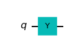
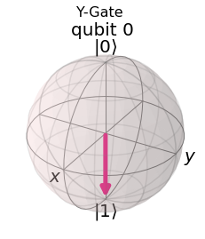
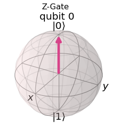

# Quantum States und Qubits

## Single Qubit Gates


```python
import numpy as np

# Importing standard Qiskit libraries
from qiskit import QuantumCircuit, transpile, Aer, IBMQ
from qiskit.tools.jupyter import *
from qiskit.visualization import *
from ibm_quantum_widgets import *
from qiskit.providers.aer import QasmSimulator

# Loading your IBM Quantum account(s)
provider = IBMQ.load_account()
```

    <frozen importlib._bootstrap>:219: RuntimeWarning: scipy._lib.messagestream.MessageStream size changed, may indicate binary incompatibility. Expected 56 from C header, got 64 from PyObject


Import Basic Functions First


```python
import qiskit
from qiskit import ClassicalRegister, QuantumRegister, QuantumCircuit
from qiskit import execute, BasicAer, Aer
from qiskit.tools.visualization import plot_histogram, circuit_drawer

from qiskit.visualization import plot_state_qsphere
from qiskit.visualization import plot_bloch_multivector, array_to_latex
from numpy import sqrt, pi
```


### Das X-Gate

Das Pauli-X-Gatter ist eine Ein-Qubit-Drehung durch π Radiant um die x-Achse.

X|0> = |1>
X|1> = |0>
 

#### Let's do an X-gate on a qubit 0:  |0> qubit


```python
qc = QuantumCircuit(1)
qc.x(0)
qc.draw()
```


    

    


Schauen wir uns das Ergebnis der obigen Schaltung an. 
Hier verwenden wir plot_bloch_multivector(), das den Zustandsvektor eines Qubits anstelle des Bloch-Vektors nimmt.


```python
backend = BasicAer.get_backend('statevector_simulator')
job = execute(qc, backend).result()
plot_bloch_multivector(job.get_statevector(qc), title='X-Gate')


```


    

    


```python
Wir können sehen, dass der Zustand des Qubits |1> tatsächlich wie erwartet ist. 
Wir können uns dies als eine Drehung im Bogenmaß π  um die x-Achse der Bloch-Kugel vorstellen. 
Das X-Gate wird in Anlehnung an sein klassisches Analogon oft auch als NOT-Gate bezeichnet.
```

### Das Y-Gate

Das Pauli-Y-Gatter ist eine Ein-Qubit-Drehung durch π  um die y-Achse


```python
qc = QuantumCircuit(1)
qc.y(0) # Do Y-gate on qubit 0
qc.draw()
```


    

    


```python
backend = BasicAer.get_backend('statevector_simulator')
job = execute(qc, backend).result()
plot_bloch_multivector(job.get_statevector(qc), title='Y-Gate')
```


    

    


### Das Z-Gate

Das Pauli-Z-Gatter ist eine Ein-Qubit-Drehung durch π  um die z-Achse


```python
qc = QuantumCircuit(1)
qc.z(0) # Do Z-gate on qubit 0
qc.draw()
```


    

    


```python
backend = BasicAer.get_backend('statevector_simulator')
job = execute(qc, backend).result()
plot_bloch_multivector(job.get_statevector(qc), title='Z-Gate')
```


    

    


Unten sehen Sie ein Widget, das den Zustand eines Qubits auf der Bloch-Kugel anzeigt.
Wenn Sie einen der Knöpfe drücken, wird das Gate auf dem Qubit ausgeführt:


```python
# Run the code in this cell to see the widget
from qiskit_textbook.widgets import gate_demo
gate_demo(gates='pauli')
```


    HBox(children=(Button(description='X', layout=Layout(height='3em', width='3em'), style=ButtonStyle()), Button(…


    Image(value=b'\x89PNG\r\n\x1a\n\x00\x00\x00\rIHDR\x00\x00\x01 \x00\x00\x01 \x08\x06\x00\x00\x00\x14\x83\xae\x8…


### Das Hadamard Gate

Das Hadamard-Gate (H-gate) ist ein grundlegendes Quantengate. Es erlaubt, sich von den Polen der Bloch-Sphäre zu entfernen und eine Überlagerung von  |0⟩ und  |1⟩

Es werden dadurch die folgenden Transformationen durchgeführt:

H|0⟩=|+⟩
H|1⟩=|−⟩

Dies kann man sich als eine Drehung um den Bloch-Vektor [1,0,1] (die Linie zwischen der x- und der z-Achse) vorstellen, oder als eine Transformation des Zustands des Qubits zwischen der X- und der Z-Basis.

Mit dem untenstehenden Widget lässt sich mit diesen Gates experimentieren:


```python
# Run the code in this cell to see the widget
from qiskit_textbook.widgets import gate_demo
gate_demo(gates='pauli+h')
```


    HBox(children=(Button(description='X', layout=Layout(height='3em', width='3em'), style=ButtonStyle()), Button(…


    Image(value=b'\x89PNG\r\n\x1a\n\x00\x00\x00\rIHDR\x00\x00\x01 \x00\x00\x01 \x08\x06\x00\x00\x00\x14\x83\xae\x8…


```python

```


```python

```


```python

```


```python

```
