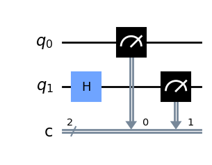
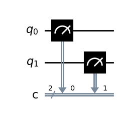

```python
import numpy as np

# Importing standard Qiskit libraries
from qiskit import QuantumCircuit, transpile, Aer, IBMQ
from qiskit.tools.jupyter import *
from qiskit.visualization import *
from ibm_quantum_widgets import *
from qiskit.providers.aer import QasmSimulator

# Loading your IBM Quantum account(s)
provider = IBMQ.load_account()
```

    /tmp/ipykernel_82/1994989634.py:11: DeprecationWarning: The qiskit.IBMQ entrypoint and the qiskit-ibmq-provider package (accessible from 'qiskit.providers.ibmq`) are deprecated and will be removed in a future release. Instead you should use the qiskit-ibm-provider package which is accessible from 'qiskit_ibm_provider'. You can install it with 'pip install qiskit_ibm_provider'. Just replace 'qiskit.IBMQ' with 'qiskit_ibm_provider.IBMProvider'
      provider = IBMQ.load_account()


```python
import qiskit
from qiskit import ClassicalRegister, QuantumRegister, QuantumCircuit
from qiskit import execute, BasicAer, Aer
from qiskit.tools.visualization import plot_histogram, circuit_drawer

from qiskit.visualization import plot_state_qsphere
from qiskit.visualization import plot_bloch_multivector, array_to_latex
from numpy import sqrt, pi
```

### Vorhersage des Outputs eines Qubits

Nehmen wir an, wir haben einen Quantenschaltkreis, der aus einem einzigen Qubit besteht. 
Wenn sich das Qubit nicht in Superposition befindet, ist es einfach, seinen Wert als 0 oder 1 vorherzusagen.


```python
qc = QuantumCircuit(1, 1)
qc.measure(0, 0)
backend = BasicAer.get_backend('qasm_simulator')
result = execute(qc, backend, shots=1000).result()
```

Alle Messungen (**shots**) an dieser Schaltung ergeben eine 0. 
Wenn wir den Bit-Flip-Operator (**X-Gate**) anwenden würden, wäre der Wert 1. Das Ergebnis der obigen Schaltung ist unten dargestellt.


```python
print(result.get_counts())
display(qc.draw('mpl'))
```

    {'10': 499, '00': 501}


    

    


Bringen wir das Qubit in eine Superposition und schauen die Vorhersageergebnisse an: 
Da das Qubit nun sowohl den Wert 0 als auch den Wert 1 enthält, wäre zu erwarten, dass das Ergebnis 50/50 aufgeteilt wird, d.h.: 
{'0': 500, '1': 500}. 
Schauen wir uns das Ergebnis an.


```python
qc = QuantumCircuit(1, 1)
qc.h(0)
qc.measure(0, 0)
result = execute(qc, backend, shots=1000).result()

```

Wie man sieht, ist das Ergebnis gleichmässig verteilt:


```python
print(result.get_counts())
display(qc.draw('mpl'))
```

    {'10': 499, '00': 501}


    

    


### Vorhersage des Outputs von zwei Qubits

Gehen wir jetzt einen Schritt weiter und verwenden als nächstes zwei Qubits. 
Es ist wichtig, mit der Vorhersage der Messwerte von Quantenschaltungen vertraut zu sein, um Quantencomputerschaltungen genau aufbauen und analysieren zu können 
(insbesondere für die Zertifizierungsprüfung!).


```python
qc = QuantumCircuit(2, 2)
qc.measure([0,1], [0,1])
result = execute(qc, backend, shots=1000).result()

```

Wie könnte das Ergebnis der obigen Schaltung aussehen ?
Da wir zwei Qubits haben (ohne Überlagerung), wäre als Ergebnis {'00': 1000} zu erwarten. 

Werfen wir einen Blick auf das Ergebnis:


```python
print(result.get_counts())
display(qc.draw('mpl'))
```

    {'00': 1000}


    

    


Was aber, wenn wir eines der Qubits mit einem Bitflip versehen?


```python
qc = QuantumCircuit(2, 2)
qc.x(1)
qc.measure([0,1], [0,1])
result = execute(qc, backend, shots=1000).result()

```

Wir haben den Wert des zweiten Qubits invertiert. 
Wie könnte das Ergebnis der obigen Schaltung aussehen ?
Da die Konvention ist, die Ausgabe von rechts nach links zu zeigen (wobei q0 der Wert ganz rechts ist), sollten wir erwarten, das Ergebnis als {'10': 1000}.


```python
print(result.get_counts())
display(qc.draw('mpl'))
```

    {'10': 1000}


    

    


Als nächstes setzen wir ein Qubit in Superposition. 
Da dieses Qubit nun sowohl den Wert 0 als auch den Wert 1 annehmen kann, nehmen wir an, 
das wir für alle möglichen Kombinationen dieses Qubits zusammen in Überlagerung mit dem statischen Qubit gleichzeitige Werte erhalten,
d.h. {'00': 500, '10': 500}. 
Wir erwarten, dass das zweite Qubit (das am weitesten links liegende, das wir in Überlagerung gebracht haben) einen möglichen Wert von sowohl 0 als auch 1 enthält, 
während das erste Qubit (das am weitesten rechts liegende) fest bei 0 bleibt.


```python
qc = QuantumCircuit(2, 2)
qc.h(1)
qc.measure([0,1], [0,1])
result = execute(qc, backend, shots=1000).result()
```

Man sieht, dass das erste Qubit auf 0 fixiert bleibt, während das zweite sowohl 0 als auch 1 hat.


```python
print(result.get_counts())
display(qc.draw('mpl'))
```

    {'10': 499, '00': 501}


    

    


```python

```


```python

```


```python

```
