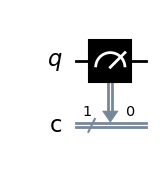
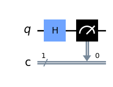
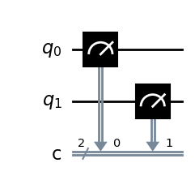
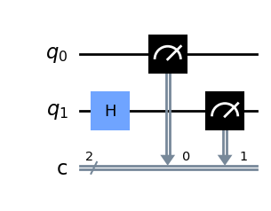
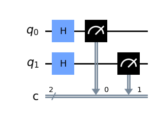
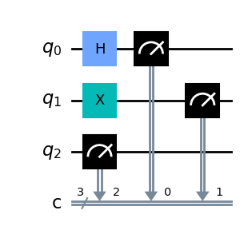

[zurück](../study-guide.md)<details open>
<summary>Import Basic Functions First</summary>

    import numpy as np

    # Importing standard Qiskit libraries
    from qiskit import QuantumCircuit, transpile, Aer, IBMQ
    from qiskit.tools.jupyter import *
    from qiskit.visualization import *
    from ibm_quantum_widgets import *
    from qiskit.providers.aer import QasmSimulator

    # Loading your IBM Quantum account(s)
    provider = IBMQ.load_account()
    
    import qiskit
    from qiskit import ClassicalRegister, QuantumRegister, QuantumCircuit
    from qiskit import execute, BasicAer, Aer
    from qiskit.tools.visualization import plot_histogram, circuit_drawer

    from qiskit.visualization import plot_state_qsphere
    from qiskit.visualization import plot_bloch_multivector, array_to_latex
    from numpy import sqrt, pi

</details>
### Vorhersage des Outputs eines Qubits

Nehmen wir an, wir haben einen Quantenschaltkreis, der aus einem einzigen Qubit besteht. 
Wenn sich das Qubit nicht in Superposition befindet, ist es einfach, seinen Wert als 0 oder 1 vorherzusagen.


```python
qc = QuantumCircuit(1, 1)
qc.measure(0, 0)
backend = BasicAer.get_backend('qasm_simulator')
result = execute(qc, backend, shots=1000).result()
print(result.get_counts())
display(qc.draw('mpl'))
```

    {'0': 1000}


    

    


Alle Messungen (**shots**) an dieser Schaltung ergeben eine 0. 
Wenn wir den Bit-Flip-Operator (**X-Gate**) anwenden würden, wäre der Wert 1. Das Ergebnis der obigen Schaltung ist unten dargestellt.

Bringen wir das Qubit in eine Superposition und schauen die Vorhersageergebnisse an: 
Da das Qubit nun sowohl den Wert 0 als auch den Wert 1 enthält, wäre zu erwarten, dass das Ergebnis 50/50 aufgeteilt wird, d.h.: 
{'0': 500, '1': 500}. 
Schauen wir uns das Ergebnis an.


```python
qc = QuantumCircuit(1, 1)
qc.h(0)
qc.measure(0, 0)
result = execute(qc, backend, shots=1000).result()
print(result.get_counts())
display(qc.draw('mpl'))
```

    {'1': 492, '0': 508}


    

    


Wie man sieht, ist das Ergebnis gleichmässig verteilt:

### Vorhersage des Outputs von zwei Qubits

Gehen wir jetzt einen Schritt weiter und verwenden als nächstes zwei Qubits. 
Es ist wichtig, mit der Vorhersage der Messwerte von Quantenschaltungen vertraut zu sein, um Quantencomputerschaltungen genau aufbauen und analysieren zu können 
(insbesondere für die Zertifizierungsprüfung!).


```python
qc = QuantumCircuit(2, 2)
qc.measure([0,1], [0,1])
result = execute(qc, backend, shots=1000).result()
display(qc.draw('mpl'))
```


    

    


Wie könnte das Ergebnis der obigen Schaltung aussehen ?
Da wir zwei Qubits haben (ohne Überlagerung), wäre als Ergebnis {'00': 1000} zu erwarten. 

Werfen wir einen Blick auf das Ergebnis:


```python
print(result.get_counts())

```

    {'00': 1000}


Was aber, wenn wir eines der Qubits mit einem Bitflip versehen?


```python
qc = QuantumCircuit(2, 2)
qc.x(1)
qc.measure([0,1], [0,1])
result = execute(qc, backend, shots=1000).result()
display(qc.draw('mpl'))
```


    

    


Wir haben den Wert des zweiten Qubits invertiert. 
Wie könnte das Ergebnis der obigen Schaltung aussehen ?
Da die Konvention ist, die Ausgabe von rechts nach links zu zeigen (wobei q0 der Wert ganz rechts ist), sollten wir erwarten, das Ergebnis als {'10': 1000}.


```python
print(result.get_counts())

```

    {'10': 1000}


Als nächstes setzen wir ein Qubit in Superposition. 
Da dieses Qubit nun sowohl den Wert 0 als auch den Wert 1 annehmen kann, nehmen wir an, 
das wir für alle möglichen Kombinationen dieses Qubits zusammen mit dem statischen Qubit in Superposition gleiche Anzahl an Wahrscheinlichkeiten der Werte erhalten,
d.h. {'00': 500, '10': 500}. 

Wir erwarten, dass das zweite Qubit (das am weitesten links liegende, das wir in Überlagerung gebracht haben) einen möglichen Wert von sowohl 0 als auch 1 enthält, 
während das erste Qubit (das am weitesten rechts liegende) fest bei 0 bleibt.


```python
qc = QuantumCircuit(2, 2)
qc.h(1)
qc.measure([0,1], [0,1])
result = execute(qc, backend, shots=1000).result()
display(qc.draw('mpl'))
```


    

    


Man sieht, dass das erste Qubit auf 0 fixiert bleibt, während das zweite sowohl 0 als auch 1 hat.


```python
print(result.get_counts())

```

    {'10': 500, '00': 500}


Was passiert, wenn wir beide Qubits in Superposition bringen? 
Nun, jetzt erhalten wir alle Möglichkeiten für zwei Qubits 00, 01, 10, 11, die jeweils in 4 gleiche Ergebnisse aufgeteilt sind.


```python
qc = QuantumCircuit(2, 2)
qc.h(0)
qc.h(1)
qc.measure([0,1], [0,1])
result = execute(qc, backend, shots=1000).result()
print(result.get_counts())
display(qc.draw('mpl'))
```

    {'11': 252, '00': 238, '01': 259, '10': 251}


    

    


### Vorhersage der Ausgabe von drei Qubits

Schauen wir uns ein weiteres Beispiel an, diesmal mit 3 Qubits. 
Um nicht den Überblick zu verlieren, bringen wir nur eines der Qubits in Superposition . 
Wie könnte das Ergebnis der folgenden Schaltung dann aussehen ?


```python
qc = QuantumCircuit(3, 3)
qc.h(0)
qc.x(1)
qc.measure(range(3), range(3))
result = execute(qc, backend, shots=1000).result()
display(qc.draw('mpl'))
```


    

    


Wenn Sie erwarten, dass die Ausgabe zwei mögliche Kombinationen enthält, die gleichmäßig aufgeteilt sind, dann liegen Sie richtig! 

Wir sollten folgendes Ergebnis sehen {'010: 500, '011': 500}. 

Und warum? 

Weil das erste Qubit (das ganz rechte) in die Superposition gesetzt wird, also sowohl eine 0 als auch eine 1 hat. 

Das zweite Qubit (das mittlere) ist auf 1 geflippt (X-Gate) und bleibt auf diesem Wert stehen. 

Das dritte Qubit (das am weitesten links liegende) wird als 0 belassen, so dass wir 010 und 011 haben.


```python
print(result.get_counts())

```

    {'010': 500, '011': 500}


Wir könnten diesen Abschnitt zwar erweitern, indem wir alle Qubits in Überlagerung bringen qc.h(range(3)), aber Sie können sich vorstellen, wie die Ausgabeergebnisse exponentiell mit der Anzahl der Qubits in Überlagerung wachsen können (das Beispiel sollte für die Zertifizierungsprüfung reichen !).


Übrigens, wenn Sie sich für das Ergebnis von 3 Qubits in Superposition interessieren, würde es in der Tat zu einer gleichmäßigen Aufteilung von 2^3 Möglichkeiten {'110': 113, '111': 108, '001': 134, '100': 116, '011': 145, '010': 141, '000': 111, '101': 132} kommen.


Damit sollte klar geworden sein, wie die Messung der Ausgaben einer Quantenschaltung funktioniert.
Machen wir weiter mit dem Bau des nächsten Quanten-Gates - diesmal mit zwei Qubits statt nur einem, dem Y-Gate!


[zurück](../study-guide.md)