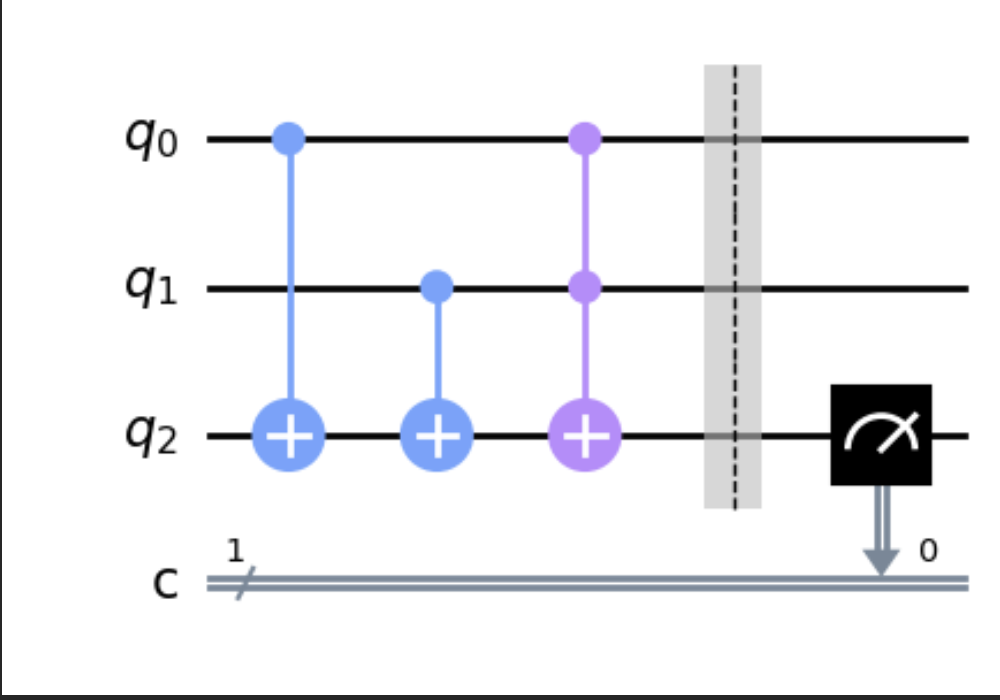

# 

[comment]: <> (This is a comment, it will not be included)
[//]: <> (This is also a comment.)

### [zurück zum Index](index.md)

## Einen Quantencomputer programmieren

Einen Quantencomputer kann inzwischen jeder bequem von zu Hause aus programmieren. 
Aber was soll man programmieren? 
Und was ist überhaupt ein Quantenprogramm, ein Quantencomputer bzw Quantencomputing ?

Da mich das Thema interessiert, habe ich mir vorgenommen, diese und weitere Fragen im Rahmen einer Zertifizierung zum Quantencomputer-Entwickler zu vertiefen.
Die notwendigen Voraussetzungen für eine Zertifizierung sind hier

[IBM Certified Associate Developer - Quantum Computation using Qiskit v0.2X ](https://www.ibm.com/training/certification/C0010300)

Beschrieben.

Nach bestandener Prüfung erhält man dann das entsprechende Zertifikat:

[Credly: IBM Certified Associate Developer - Quantum Computation using Qiskit v0.2X ](https://www.credly.com/badges/65586d0d-ba5e-4698-ab0f-fd3448cdd6b2/public_url)

Das Verständnis über Quantencomputing und die Themen Quantenschaltungen, Qubit-Gates, Bloch-Sphären und das Qiskit SDK sind Teil der zu lernenden Themen zum  Quantencomputer-Entwickler. 

Quantencomputing hat es das Potenzial, das Computing zu revolutionieren und ein wichtiges technologisches Werkzeug für Entwickler, Ingenieure und Personalverantwortliche in Unternehmen zu werden. Sowohl im Bereich der Hardware, also der Technologie, auf der Quantencomputer basieren als auch im Bereich der Software, mit dem diese neuen Computersysteme programmiert werden, hat sich ein weltweiter Wettkampf entfacht. 

Auf den folgenden Seiten werden die verschiedenen Themen vorgestellt, einschließlich der Definition, Ausführung und Visualisierung von Quantenschaltungen mit Qiskit. In Notebook Beispielen werden auch Einzel- und Multi-QuBit-Gatter und die damit verbundenen Rotationen auf der Bloch-Sphäre. In den Bespielen wird dann einfacher verständlich, wie man das Qiskit SDK verwendet, um Quantencomputeranwendungen zu implementieren und mit der Programmierung eigener Quantencomputerprogramme zu beginnen.

Hierzu gibt es dann sowohl die Möglichkeit, die Beispiele in der Cloud Umgebung von IBM 

[IBM Quantum Lab ](https://quantum-computing.ibm.com/lab)

oder in seiner eigenen lokal installierten Python+Quiskit Entwicklungsumgebung.

# Table of contents

1. [My Personal Experience Taking the Certification ExamIBM Quantum Composer](#personalexperience)
2. [Creating Logic Gates with IBM Quantum Composer](#composer)
3. [Messung der Ausgaben im IBM Quantum Composer](#measuring)
4. [Vorhersage der Ausgabe von Quantenschaltungen](#predicting)
5. [X Gate (NOT)](#x-gate)
6. [Y Gate](#y-gate)
7. [CNOT Gate (AND)](#CNOT-gate)
8. [NAND Gate](#NAND-gate)
9. [XOR Gate](#XOR-gate)
10. [OR Gate](#OR-gate)
[Quantum Gate Icons]
[Initializing Qubits Using State Vectors]
[Two Methods to Load a State Vector]
[Calculating the Depth of a Quantum Circuit]
[Drawing a Quantum Circuit]
[Plotting a Bloch Sphere]
[Initializing a Qubit in Superposition]
[Initializing a Qubit to a Variable Degree]
[Collapsing a Superposition]
[Quantum Circuit Identities]
[Creating an X-gate from HZH]
[Entanglement]
[Bell States]
[Swapping Two Qubits]
[Swapping N Qubits]
[GHZ State]
[A Unitary Matrix for a Quantum Circuit]
[Phase Kickback]
[Barrier Operations]
[Qiskit Version]
[Running on IBMQ]
[Monitoring the Status of a Job]
[Visualizing Quantum Circuits]
[OpenQASM]
[Plotting Gate Maps and Error Rates]
[Creating Phase on Qubits]
[Fidelity]
[Density Matrix]
[Creating Custom Gates]
[Composing Circuits from Other Circuits]
[Decomposing a Quantum Circuit]
[Adding Controls to Gates]

## Meine persönliche Erfahrungen mit Quiskit und dem Weg zum Quiskit Developer 

Meine eigene Quantum-Geschichte ist natürlich eng mit meiner eigentlichen beruflichen Aufgabe bei IBM verbunden, dh wo entwickeln sich neue Technologien und in welchen Bereichen werden diese Technologien möglicherweise zum Einsatz kommen. 

Ich bin fest davon überzeugt, dass das Quantencomputing das unglaubliche Potenzial hat, die Art und Weise, wie Computer eingesetzt werden, zu revolutionieren. Die Programmierer von heute werden sich weiterbilden müssen, um mit der sich ständig verändernden Welt der Technologie Schritt zu halten. Wir haben bereits gesehen, wie schnell sich die Dinge mit künstlicher Intelligenz und maschinellem Lernen ändern können. Mit chatGPT und openAI bieten sich neue und immer mächtigere Möglichkeiten im Zusammenhang mit Large Language Models . Möglicherweise erleben wir auch gerade den Beginn der Quantencomputer-Revolution.

Vor diesem Hintergrund macht es aus meiner Sicht, auch und gerade als Software Entwickler sich frühzeitig mit dem Thema zu beschäftigen , um die Potentiale für Aufgabenstellungen zu nutzen, die heute mit klassischen Computern nur mit sehr grossem Aufwand oder noch gar nicht mit vertretbarem Aufwand gelöst werden können.

## Erstellung von Quantenschaltungen im Webfrontend / Browser 

Der IBM Quantum Composer [IBM Quantum Composer ](https://quantum-computing.ibm.com/composer/files/new) ist eine grafische, webbasierte Anwendung zur Visualisierung und Erstellung von Quantenschaltungen. 

Sie ermöglicht es, durch Ziehen und Ablegen von Quantencomputer-Schaltkreisen (d. h. Operationen) Quantenschaltungen zu erstellen und sie in einem Simulator oder auf einem echten Quantencomputer bei IBM auszuführen.

Schauen wir uns kurz an, wie man mit Qubits (Quantencomputer-Bits) und der IBM Quantum Composer-Anwendung einige grundlegende logische Gatter erstellt.

## Erstellen von Logic Gates mit IBM Quantum Composer 

Quantencomputer-Bits werden als sog. "Qubits" bezeichnet. Genau wie ein klassisches Bit in einem Computer können Qubits den Wert 0 oder 1 darstellen. In einem Quantencomputer können Qubits jedoch überlagert werden, so dass sie gleichzeitig die Werte 0 und 1 oder jeden beliebigen Wert dazwischen annehmen können.

Wenn wir die Qubits nicht in Superposition bringen, verhalten sie sich wie klassische Bits, was zu einer direkten Messung von entweder 0 oder 1 führt. Das macht es uns leichter, mit Qubits und dem IBM Quantum Composer zu experimentieren, indem wir logische Gatter zur Durchführung von Operationen in einem Quantenschaltkreis erstellen. 

Zu den grundlegendsten Gattern gehören NOT, AND, OR, NAND und XOR. Im Folgenden schauen wir uns an, wie jedes dieser logischen Gatter im Quantencomputing mit Qubits und dem IBM Quantum Composer erstellt werden kann. Wir werden auch sehen, wie wir jedes dieser logischen Gatter sowohl auf dem IBM Quantum Composer als auch in Python mit Qiskit nachbilden können.

Wir beginnen mit den einfachsten Gattern, der Menge der Pauli-Gatter (X, Y, Z) (https://en.wikipedia.org/wiki/Quantum_logic_gate#Pauli_gates_%28X,Y,Z%29).

### X Gate (NOT) 

The most simplest of the logic gates is the Pauli X-gate, also called the NOT gate. This gate simply inverts the value of a qubit from 0 to 1 or 1 to 0. Due to this simple inversion of the value, the Pauli X-gate is often referred to as a bit-flip, since it “flips the bits” of the affected qubits.

Der einfachste der logic gates, also Schaltkreise, ist das Pauli X-Gate, auch NOT-Gate genannt. Dieses Gate invertiert einfach den Wert eines Qubits von 0 auf 1 oder 1 auf 0. 
Aufgrund dieser einfachen Umkehrung des Werts wird das Pauli X-Gate oft als "Bit-Flip" bezeichnet, da es die Bits der betroffenen Qubits "umdreht".

Im Composer stellt sich das dann wie folgt dar:

Im obigen Screenshot ist zu sehen, wie ein einzelnes X-Gate auf ein Qubit angewendet wird, gefolgt von einer Messanweisung. 
Die sich daraus ergebenden Wahrscheinlichkeiten im blauen Balkendiagramm zeigen eine 100%ige Wahrscheinlichkeit, dass das Qubit eine 1 misst.

Wir können diese einfache Schaltung im IBM Quantum Composer erstellen, indem wir ein NOT-Gatter, gekennzeichnet durch das Pluszeichen mit einem Kreis, auf ein einzelnes Qubit ziehen, gefolgt von einem Messsymbol.

Da Qubits mit einem Standardzustand von 0 initialisiert werden, ergibt unsere Messung des Qubits nach Anwendung des NOT-Gatters den Wert 1.

Im folgenden Beispiel wird dies anhand von Python Qiskit gezeigt.

	from qiskit import qiskit, QuantumCircuit

	# Create a quantum circuit with 1 qubit and 1 classical bit.
	qc = QuantumCircuit(1, 1)

	# Apply a NOT gate on qubit 0.
	qc.x(0)

	# Measure qubit 0.
	qc.measure(0, 0)

	job = qiskit.execute(qc, qiskit.BasicAer.get_backend('qasm_simulator'))
	print(job.result().get_counts())

Im obigen Beispiel erstellen wir einen QuantumCircuit mit einem Qubit und einem klassischen Bit. 
Wir wenden das Pauli X-Gate an, um das Qubit von einem Standardwert von 0 in einen Wert von 1 umzuwandeln, und messen schließlich das resultierende Qubit in einem klassischen Register. 
Wir lassen die Schaltung im Simulator lassen uns die Ergebnisse jeweils ausgeben:

	1 {'1': 1024}

	1 {'0': 1024}

Wenn wir zwei X-Gates nacheinander schalten, sehen wir, dass das Qubit von 1 auf 0 wechselt.

In meinem folgenden Jupyter Notebook findet ihr weitere Beispiele für Single Gates und wie man die Ergebnisse im Quantum Lab visualisieren kann. In der Vorbereitung auf die Prüfung fand ich es hilfreich, die Funktionen in dem Quantum Lab einfach mal auszuprobieren, d.h. durch Verändern der Parameter direkt zu sehen, wie sich das auf das jeweilige Ergebnis auswirkt. Das macht die Sache wenigstens etwas greifbarer, da das Arbeiten mit einer simplen Quanten Schaltung als solches noch nicht so wahnsinnig spannend ist :-)

[Single Gates - X, Y, Z-Gate und Hadamard](quiskit-python-samples/prep-single-gates-xyz/prep-single-gates-xyz.md)

## Messung der Ausgaben im IBM Quantum Composer 

Da wir gerade das X-Gate zur Invertierung eines Qubits vorgestellt haben, ist dies ein guter Zeitpunkt, um zu zeigen, wie man das Wahrscheinlichkeits-Balkendiagramm des IBM Quantum Composers liest, um die Ausgabe eines Quantenschaltkreises zu verstehen.

Im obigen Beispielwerden in dem blauen Balkendiagramm die Wahrscheinlichkeiten für 0 und 1 für ein einzelnes Qubit anzeigt. 
In diesem Fall war das Ergebnis eine 100%ige Wahrscheinlichkeit, eine 1 zu messen (oder einfach ein Wert von 1).

Die Ausgangswahrscheinlichkeiten für einen Quantenschaltkreis werden in diesem Balkendiagramm auf IBM Quantum Composer angezeigt. 
Würden zwei Qubits in der Schaltung verwendet, würde das Diagramm Striche für 00, 01, 10, 11 enthalten. 
Bei drei Qubits wären es 000, 001, 010, 011, 100, 101, 110, 111. 
Auf diese Weise können Sie sehen, zu welchem Ergebnis das Qubit nach Anwendung einer Reihe von Quantengattern führen würde.

Sie können die Änderungen in der Ausgabe der Qubits auch mit dem IBM Quantum Composer Inspector Tool schrittweise nachvollziehen. 
Aktivieren Sie dazu Inspect Button.

Sie können dann die Ausführung jedes logischen Gatters im Quantenschaltkreis durchspielen und die Änderungen Schritt für Schritt sehen.

Es ist wichtig zu beachten, dass die im Balkendiagramm angezeigten Bits von rechts nach links gelesen werden, entsprechend jedem Qubit im Schaltkreis (von 0 ... i). 
Wenn der Quantenschaltkreis zum Beispiel zwei Qubits (q0, q1) hat und das erste Qubit den Zustand 1 hat (q0=1, q1=0), würde das Ausgangsdiagramm 01 = 1 anzeigen. 
Von rechts nach links gelesen hat q0 den Wert 1 und q1 den Wert 0, und dieses Ergebnis (01) hat eine Wahrscheinlichkeit von 100 % - was bedeutet, dass die Schaltung einen Ergebniswert von 01 hat.

Im dem Screenshot sieht man, dass der Quantenschaltkreis drei Qubits enthält. 
Die ersten beiden Qubits haben den Standardwert 0 und das dritte Qubit ist invertiert und hat den Wert 1. 
Die resultierende Ausgabewahrscheinlichkeit in IBM Quantum Composer wird als 100 mit einer Wahrscheinlichkeit von 100 % angezeigt. 
Von rechts nach links gelesen: 

q0=0, q1=0, q2=1.

Nachdem wir jetzt gesehen haben, wie man die Ausgabe eines Quantenschaltkreises in IBM Quantum Composer ablesen kann, sehen wir uns als nächstes an, wie man die Ausgabe eines beliebigen Quantenschaltkreises vorhersagen kann.

## Vorhersage der Ausgabe von Quantenschaltungen 

Quantenschaltungen werden mit Qubits aufgebaut, die einem beliebigen Wert zwischen 0 und 1 entsprechen. 
Befindet sich ein Qubit nicht in der Superposition (Überlagerung), gibt es einen eindeutigen Wert von 0 oder 1 aus. 
Befindet sich ein Qubit jedoch in der Superposition, so hält es gleichzeitig den Wert 0 und 1. 
Aus diesem Grund kann es etwas schwierig sein, die Ausgabe eines Quantenschaltkreises vorherzusagen, insbesondere wenn er Qubits in superpositions enthält.

Sehen wir uns also ein paar Beispielschaltungen für Quantencomputer an und lernen, wie man ihr Ergebnis vorhersagen kann. 
Beginnen wir mit einer Quantenschaltung, die erst ein einzelnes Qubit und dann zwei Qubits enthält.

[Vorhersage der Ausgabe von Quantenschaltungen](study-guide-chapter/Ausgabe-Vorhersagen/Ausgabe-Vorhersagen.md)

### Y-Gate (NOT) 

Ein weiteres grundlegendes Ein-Qubit Pauli Gate ist das **Y-Gate**. Das Y-Gate entspricht einem Bitwert- und Phasenflip in einem Vorgang. Das heißt, während das X-Gate nur den Bitwert für das Qubit von 0 auf 1 oder von 1 auf 0 umdreht, dreht das Y-Gate nicht nur den Wert, sondern auch die Phase von +1 auf -1 oder von -1 auf +1.

Befindet sich das Qubit nicht in einer Superposition mit einem Hadamard-Gate, sieht das Y-Gate genauso aus wie ein X-Gate, das einfach den klassischen Wert von 0 auf 1 umkehrt. Wird jedoch zuerst ein Hadamard-Gate angewendet, hat das Y-Gate den zusätzlichen Effekt, dass es die Phase umkehrt.

Wie in der obigen Schaltung zu sehen ist, wurden 3 Qubits hinzugefügt. Das erste Qubit wendet einfach ein X-Gate an, das den Wert von 0 auf 1 umkippt. Das zweite Qubit wendet ein Y-Gate ohne Superposition an, das wiederum den Wert von 0 auf 1 umkippt. Das dritte Qubit jedoch wird über das Hadamard-Gate in Superposition gebracht und wendet dann ein Y-Gate an, das den Wert von 0 auf 1 umkippt und auch die Phase auf -1 umkippt (wie in der Phasenscheibe auf der rechten Seite der Qubit-Zeile zu sehen ist).

[Single Gates - X, Y, Z-Gate und Hadamard](quiskit-python-samples/prep-single-gates-xyz/prep-single-gates-xyz.md)

### CNOT Gate (AND) 

Während das NOT-Gate im obigen Beispiel mit einem einzelnen Qubit arbeitet, arbeitet die nächste Gruppe von Gates mit zwei Qubits. Das AND-Gate nimmt zwei Eingangs-Qubits. Wenn beide den Wert 1 haben, wird das resultierende Qubit auf 1 gesetzt. 
Wenn eines der Eingangs-Qubits 0 ist, wird das resultierende Qubit 0 sein.

Ein AND-Gate kann leicht mit Hilfe eines **Toffoli**-Gate konstruiert werden, das auch "CCNOT-Gate" (d.h. doppelt gesteuertes NOT-Gate) oder "AND-Gate" genannt wird. 
Ein Toffoli-Gate nimmt einfach zwei Eingangs-Qubits und dreht den Wert eines resultierenden Qubits um, wenn die beiden Eingänge den Wert 1 haben. Dies führt effektiv eine AND-Operation durch.

Wie in der obigen Quantenschaltung im IBM Quantum Composer zu sehen ist, werden zwei Qubits mit dem Wert 1 initialisiert (durch Anwendung des X-Gatters auf jedes Qubit, wodurch deren Standardwerte von 0 auf 1 invertiert werden). 
Dann wird ein Toffoli-Gate (CCNOT) auf die beiden Eingangs-Qubits angewendet, dessen Ausgang in einem dritten Qubit gespeichert ist. 
Da die beiden Eingangs-Qubits den Wert 1 haben, wird das resultierende Ausgangsbit von 0 auf 1 umgedreht.

In der Wahrscheinlichkeitsausgabe zeigt der IBM Quantum Composer eine 100%ige Wahrscheinlichkeit für das Ergebnis von 111 an. 
Wenn man die Ausgabe von rechts nach links liest, ist 

q0=1, q1=1, q2=1. 

Das macht Sinn, da die ersten beiden Qubits mit dem Wert 1 initialisiert wurden (indem ihre Werte mit dem X-Gate invertiert wurden) und ein Toffoli-Gate auf diese beiden Qubits angewendet wurde, um das Ergebnis im dritten Qubit zu speichern. 
Da das Toffoli-Gate eine AND-Verknüpfung ist und die beiden Eingänge 1 waren, ist 1 AND 1 gleich 1 - also hat das dritte Qubit den Wert 1.

Um dies etwas besser zu beweisen, hier ein Beispiel für die Ausführung derselben Quantenschaltung mit einem AND-Gatter, wobei das erste Qubit den Wert 1 und das zweite Qubit den Wert 0 hat (q0=1, q1=0, q2=0).

Da 1 AND 0 gleich 0 ist, ergibt die resultierende Wahrscheinlichkeitsausgabe (von rechts nach links gelesen) eine 100%ige Wahrscheinlichkeit für die Messung von 001.
Wir können den Python Qiskit Code für ein AND-Gatter mit dem folgenden Beispiel schreiben.

### NAND Gate (AND) 

In Anlehnung an das obige Beispiel kann ein  NAND-Gate (NOT AND) implementiert werden, indem  fast die gleiche Schaltung wie im obigen Beispiel für AND verwendet wird und zusätzlich ein NOT-Operator auf das Ergebnis angewendet wird.

[NAND Gate](quiskit-python-samples/NAND_Gate.md)

Zu beachten ist, dass ein X-Gate auf die ersten beiden Eingangs-Qubits angewendet wurde. 
Dann ein Toffoli-Gate (AND) auf die ersten beiden Eingänge und das Ergebnis der Operation im dritten Qubit gespeichert. 
Um schließlich eine NAND-Verknüpfung zu implementieren, wird ein X-Gate auf das Ausgangs-Qubit angewendet, das seinen Wert umkehrt.

In der Ausgangswahrscheinlichkeit ist zu sehen, dass das Ergebnis 011 ist (q0=1, q1=1, q2=0), da 1 NOT AND 1 gleich 0 ist.

Im Qiskit-python Code für NAND wird einfach der Operator qc.ccx() verwendet, um ein Toffoli-Gate auf die ersten beiden Qubits (q0, q1) anzuwenden und das Ergebnis im dritten Qubit (q2) zu speichern. 
Anschließend wird ein X-Gate auf das dritte Qubit (q2) angewendet, um das Ergebnis zu erzeugen.

	qc = QuantumCircuit(3, 1)
    # Set up the registers
    qc.x(0)
    qc.x(1)
    # AND
    qc.ccx(0, 1, 2)
    # Measure
    qc.measure(2, 0)
    qc.draw()

### XOR Gate (AND) 

Das XOR-Gate (oder exklusiv ODER) kann mit Hilfe eines CX-Gates, auch "kontrolliertes NOT-Gate" genannt, erstellt werden. 
Dieses Gate nimmt ein Eingangs-Qubit (Kontrollbit genannt) und ein Ausgangs-Qubit auf. 
Das Ausgangsqubit wird nur dann invertiert, wenn das Eingangsqubit den Wert 1 hat. 
Hat das Eingangsqubit den Wert 0, wird am Ausgang keine Änderung vorgenommen.

Mit Hilfe des CX-Gates lässt sich eine XOR-Verknüpfung herstellen, indem zwei CX-Gates in den Schaltkreis eingefügt werden, eines auf jedem Eingangs-Qubit, und das Ergebnis auf demselben Ausgangs-Qubit gespeichert wird. 
Da das CX-Gate das Ausgangsqubit umdreht, wenn sein Eingang den Wert 1 hat, setzt die erste CX-Gate-Operation den Ausgang auf 1, wenn der Eingang 1 war. 
So weit, so gut. 
Das zweite CX-Gate setzt den Ausgang auf das Gegenteil, wenn der zweite Eingang 1 war. 
Wenn also der erste Eingang eine 0 war, ist der Ausgang momentan eine 0 und wird daher auf eine 1 gesetzt (wenn das zweite Qubit 1 ist). 
Wenn die erste Eingabe eine 1 war und die Ausgabe eine 1 ist, wird das zweite Qubit, das den Wert 1 hat, die Ausgabe wieder auf 0 zurücksetzen. 
Das ist sinnvoll, da 1 XOR 1 gleich 0 und 0 XOR 1 gleich 1 ist.

	qc = QuantumCircuit(3, 1)
	# XOR
	qc.cx(0, 2)
	qc.cx(1, 2)
	# Measure
	qc.measure(2, 0)
	qc.draw()

Im obigen Beispiel wird auf jedes Qubit ein qc.cx() oder (kontrolliertes NOT) angewendet und das Ergebnis im dritten Qubit gespeichert. 
Danach erfolgt die Messung des Ergebnisses.

### OR Gate (AND) 

Das letzte Beispiel für ein Logik-Gate ist das OR-Gate. Während das AND-Gate die beiden Eingangs-Qubits daraufhin vergleicht, ob sie einen Wert von 1 haben, damit der Ausgang einen Wert von 1 hat, setzt das OR-Gate den Ausgang auf 1, wenn einer der beiden Eingänge 1 ist.

Das OR-Gate wird in einem Quantenschaltkreis mit zwei CX-Gates (conditional NOT), gefolgt von einem Toffoli-gate, realisiert.

	OR
	0 0: {'0': 1024}
	0 1: {'1': 1024}
	1 0: {'1': 1024}
	1 1: {'1': 1024}

Das logische OR-Gate ist etwas komplexer als unsere vorherigen Beispiele, da es ein zusätzliches logisches Gate enthält. 
Die OR-Schaltung kombiniert den bedingten NOT-Operator (CX) mit einem Toffoli-Operator (CCX), um das Ergebnis "UND" zu verknüpfen.

Im obigen Screenshot sieht das OR-Gate dem XOR-Gate sehr ähnlich. Zunächst wird daher ein bedingter NOT-Operator (CX) auf jedes der Eingangs-Qubits (q0, q1) angewendet und das Ergebnis im dritten Qubit (q2) abgespeichert. Anschließend wird wieder ein Toffoli-Gate (CCX) auf die ersten beiden Eingänge angewendet und  das Ergebnis im dritten Qubit gespeichert. Auf diese Weise wird zunächst eine XOR-Verknüpfung durchgeführt, und dann, wenn die beiden Eingänge beide 1 sind, wird der Ausgang durch das Toffoli-Gate entsprechend umgedreht.

Das heißt, um das OR-Gate zu implementieren, wenn das erste Qubit 1 ist, kippen wir das Ausgangsqubit auf 1. Andernfalls wird es bei 0 gelassen. 
Wenn das zweite Qubit 1 ist, wird das Ergebnisbit erneut gekippt (auf 0, wenn das erste 1 war, oder auf 1, wenn das erste 0 war). 
Andernfalls wird das Ausgangs-Qubit unverändert gelassen. Wenn schließlich beide Eingangs-Qubits 1 sind, wird das Ergebnis-Qubit ein weiteres Mal umgedreht.

Dies wird besser deutlich, wenn man sich den Python-Qiskit-Quellcode anschaut:

	qc = QuantumCircuit(3, 1)   
	# OR
	# If the first bit is 1, flip the result bit to 1. Otherwise, leave it as 0.
	qc.cx(0, 2)
	# If the second bit is 1, flip the result bit again (to 0 if the first is 1, or 1 if the first is 0). Otherwise, leave it as-is.
	qc.cx(1, 2)
	# If both bits are 1, flip the result bit one more time.
	qc.ccx(0, 1, 2)
	qc.barrier()
	# Measure
	qc.measure(2, 0)
	qc.draw()

Im obigen Code werden die beiden CX-Operatoren, gefolgt vom CCX, miteinander verkettet . 
Wenn z. B. 
q0=0 und q1=1 ist, 
hinterlässt der erste CX den Ausgang 0. 
Der zweite CX ändert den Ausgang auf 1. 
Der letzte CCX hinterlässt den Ausgang 1. 
0 ODER 1 ist also gleich 1. 
Der eigentliche Test ergibt sich aus dem Fall q0=1 und q1=1. 
In diesem Fall setzt die erste CX den Ausgang auf 1, die zweite CX setzt den Ausgang wieder auf 0 und die CCX setzt den Ausgang ein weiteres Mal auf 1 (da beide Eingänge 1 sind). Folglich ist 1 ODER 1 gleich 1.

Den Python-Qiskit-Code für die obigen Logikgates-Beispiele findet man hier:

https://gist.github.com/primaryobjects/49674b30f1882401b32fc46d1991ef89

### [Themenvertiefung der Quantencomputer Programmierung](../Quantum/study-guide.md)
### [Startseite](../Quantum/index.md)

