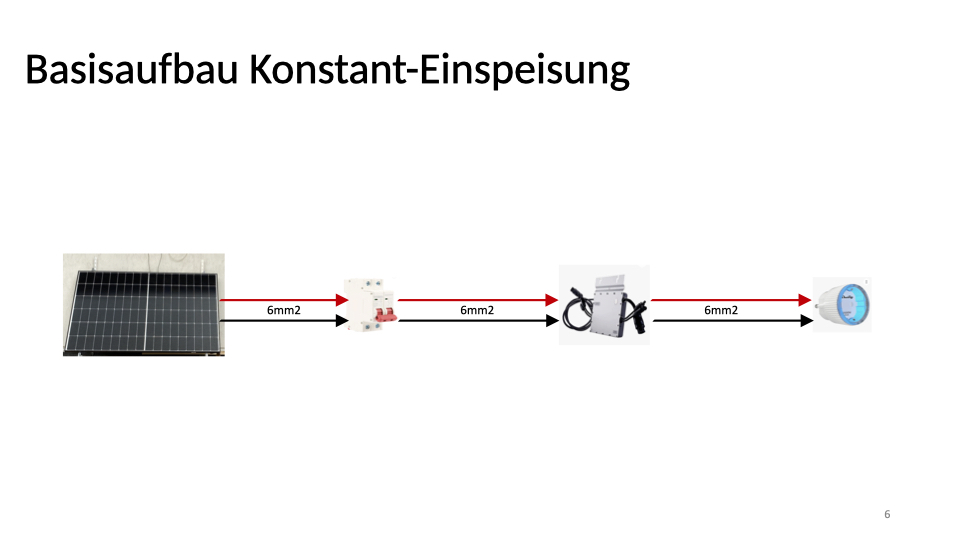

# Solarstrom clever nutzen

### [zurück zum Index](../index.md)

## Wie alles begann

Der Anfang ist immer das Schwierigste. Das kennen die meisten vermutlich.
Den Gedanken , ein bisschen Strom für den eigenen Bedarf zu produzieren, hatten sicherlich auch schon viele Leute.
Die Herausforderungen hierfür sind allerdings vielfältig und halten vermutlich nicht Wenige davon ab, den Plan dann auch irgendwann 
umzusetzen. Balkonkraftwerke bieten hier für den Otto-Normal-Verbraucher einen guten Ansatz, denn diese lassen sich von den meisten
einigermassen handwerlich geschickten Menschen selber montieren und setzen auch keine eigene Immobilie mit einem ausreichend grossen
Dach voraus. 
Die Kosten sind somit überschaubar und Handwerker braucht man bis auf einen Elektriker eigentlich auch keinen.
Wie immer, kommt man an der deutschen Bürokratie natürlich auch bei einem Balkonkraftwerk nicht vorbei - aber der Aufwand ist 
überschaubar.

## Balkonkraftwerk Direkteinspeisung

... in Arbeit...

## Balkonkraftwerk mit Speicherakku

... in Arbeit...

## Balkonkraftwerk mit Nulleinspeisung

... in Arbeit...

## Balkonkraftwerk für Notsrom

... in Arbeit...

