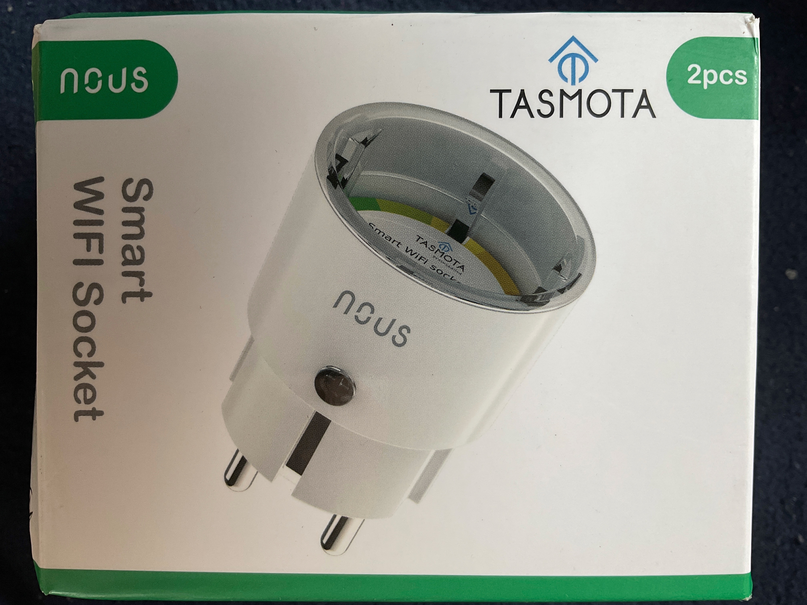
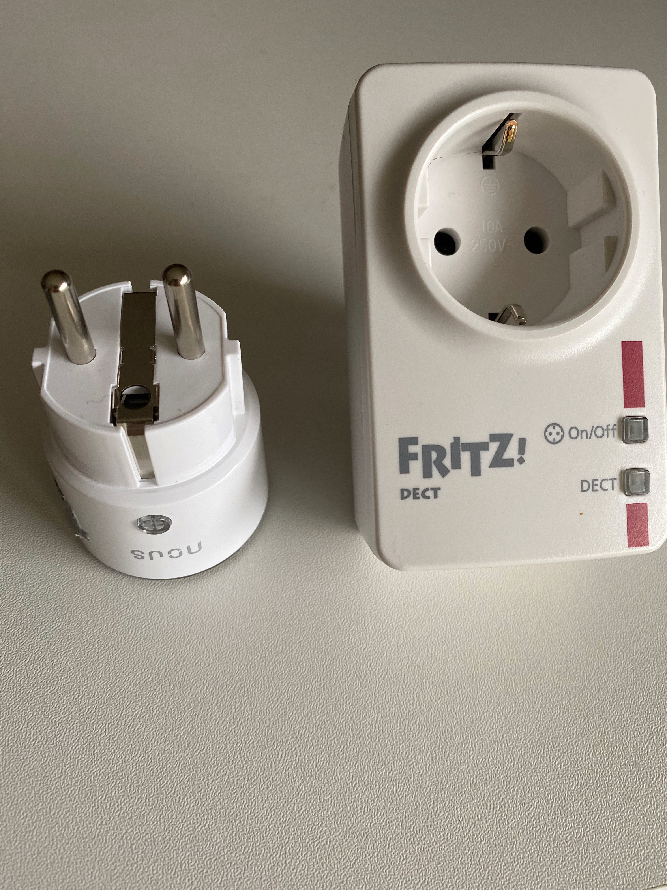
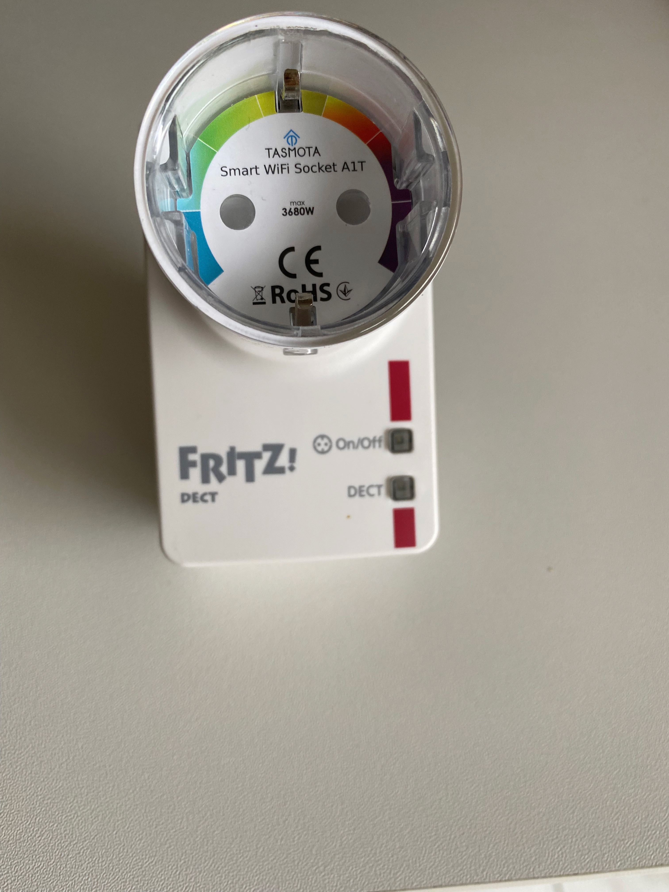
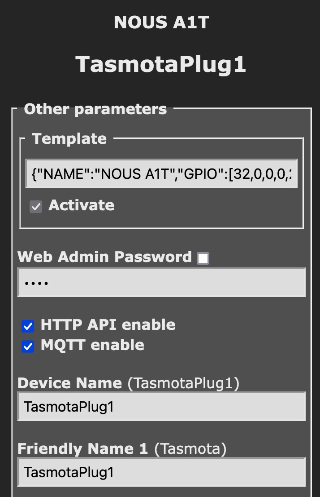
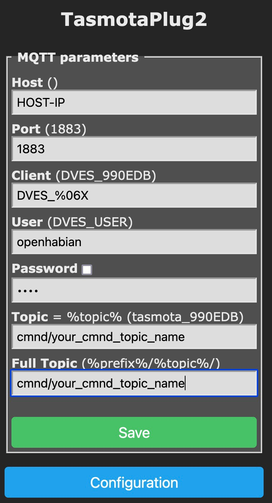

# IR Lesekopf für Stromzähler am ESP8266 mit Tasmota

[comment]: <> (This is a comment, it will not be included)
[//]: <> (This is also a comment.) 

### [zurück zum Index](../../index.md)

IR Lesekopf für Stromzähler am ESP8266 mit Tasmota

Wie bekomme ich die Daten vom Stromzähler mit einem ESP8266 in mein OpenHAB eingebunden , um In Zusammenarbeit mit der Balkon PV den hausinternen Stromverbrauch zu optimieren ?

Bevor wir loslegen, kurz noch ein paar Erklärungen zum Tasmota Begriff.  
Tasmota ist eine Software , die auf einem mikrocontroller wie dem d1 Mini, esp8266 läuft und auf vieler anderer Hardware. Diese Software kann man auf die Hardware , den ESP flashen.
Tasmota um mit dem Lesekopf  zu kommunizieren
Dafür könnte man sich tasmota auf der Releasemanagement Seite xxxx runterladen und mit einem Tool auf die entsprechende Hardware flashen
Das Problem ist, dass man die Funktionen für einen smartester und speziell für deinen eingesetzten smartmeter benötigt

https://tasmota.github.io/docs/

Bild von Features 

https://tasmota.github.io/docs/Smart-Meter-Interface/

This Feature is Not inclusive in precompiled binaren
Dh die bin enthalten nicht den nötigen Code um sich mit dem smartmeter zu verbinden und Funktionen auszuführen
Dh wir müssen uns eine eigene binare zusammenstellen und compilieren zu einem binare
SML commands müssen mit reincompiliert werden , 

#ifndef USE_SCRIPT
#define USE_SCRIPT
#endif
#ifndef USE_SML_M
#define USE_SML_M
#endif
#ifdef USE_RULES
#undef USE_RULES
#endif

Das sind die nächsten Schritte. Klingt dramatisch, bekommt aber jeder hin
Dafür brauchen wir erstmal den Quellcode von tasmota.

Auf den link oben rechts auf der tasmota Seite klicken auf die aktuellen Code Release

https://github.com/arendst/tasmota

Hier liegen alle möglichen Dateien, die nachher in unser binare kommen und somit Compiler werden müssen. Unserem Release. In dem Dev Branche werden permanent Änderungen aktualisiert . DieEi zelheiten zu dem entwickljngszyklus von tasmota will ich hier nicht weiter ausführen, dazu gibt es reichlich Material zum lesen oder exzellente YouTube Beiträge.

Ihr sollteteuch über die Tags die aktuelle Version raussuchen, in meinem Fall aktuell die Version 12.2.0   Und die diese Release als zip Datei oder gar Downloaden. Den kompletten Quellcode dann auf eurem system entpackt in ein Verzeichnis. Achtet darauf , dass ihr auf einen freigegeben stand/Tag zurückgreift
Dann habt ihr den kompletten tasmota Quellcode auf eurem system
Hier müsst ihr jetzt etwas anpassen, um die SML Funktionen mit in den Quellcode einzubinden
Wuerdetihr jetzteinfach nur complilieren, dann hätte ihr nichts gewonnen, sondern einfach nur ein Standard tasmota Release gebaut, die es auf den tasmota Seiten auch direkt zum Download gibt.

Wir fügen jetzt neue Features hinzu. 

Da wir jetzt am Code ändern müssen und eine neue Version compilieren müssen, benötigen wir eine Entwickler ide . Hier gibt es viele Möglichkeiten.die Anker beschrieben sind

https://tasmota.github.io/docs/Compile-your-build/

Ich habe auf meinem mac Visual Studio Code installiert, so dass ich exemplarisch , damit das weitere Vorgehen zeigen werde.
Ihr könnt euch brauch kostenlos Downloaden unter 

https://code.visualstudio.com/download

Aber wie gesagt, mit Gitpod und Co gibt es auch weitere Varianten. 
In Visual Studio müsst ihr dann Platform.io als Plugin installieren

https://tasmota.github.io/docs/PlatformIO/

Das hilft uns dann dabei, die ganzen Sachen auf den ESP zu flashen
Links in Vs dann auf Extensions klicken und sehe dann die Ameise Platform.Info IDE. Danach links ein neues Menü.. wieder oben links auf explorerzurueckgehen und Open folder u d in das Download Verzeichnis gehen und öffnen. Um zu gucken ob das alles funktioniert, links auf die Ameise gehen, default, und auf Build all gehen . Der baut dann das binary , erstmal ein Test, ob das alles läuft. Success, dann sollte alles funktioniert haben.
Wieder zurück in die dateiansicht und endlich die Änderungen durchführen, um unsere eigene tasmota Version zu bauen.

Wie das geht ist in der Docu beschrieben. Unter smartmeter, Compiler your own Build
Erstmal die ganzen defines kopieren, 
Und dann zurücknimmst VsCode . Dann unter tasmota , bis zu user_config-override.h . Da kann man auch andere Angaben machen und in meine binsaries einfügen, zB wlan id und Passwort etc. Also unsere kopierten Zeilen unten einfügen und speichern.
Das sagtjetzt der Projektdateien, Bau mir mein binary mit den sml geschichten. Jetzt wieder auf
Ameise klicken und Build all
Jetzt baut er das Standard binary mit den Features, die wir eben hinzugefügt haben.
Jetzt müssen wir das binary nur noch auf den esp aufspielen, flashen 
Dafür gehe ich wieder auf Dateien oben links, ganz unten die Datei Platforms-Override.ini 
Die hat VS automatisch angelegt,, ansonsten müsstestdu die sample Datei selber umbenennen und anpassen
Hier können wir jetzt verschieden Sachen konfigurieren. Da ist sehr viel drin, lasst euch dadurch nicht ablenken. Wir müssen hier nur den Upload-Port ändern, weil da steht jetzt COM5, was auf unserem Mac nicht passt. Welchen uploadport nutzen wir also ? Dazu gehen wir in ein Terminal in eine Shell und geben 
ls -la /dev/cu.*

[Ausgabe hier reinkopieren]

Was mach ich jetzt. Ich nehme hier mein d1 Mini und Stecke das ganze einfach mal in einen meiner usb Ports. Und jetzt geben wir den Befehl nochmal aus und jetzt sehe ich den richtigen usbserial-### Port . Das ganze kopiere ich jetzt einfach und das füge ich in die Datei platformio.ini ein. 

(Bild reinkoieren)

Wir haben jetzt die Features hinzugefügt. Das binary gebaut und können’s jetzt auf unseren esp flashen. Einfach auf Upload-all klicken und das sollte funktionieren. Schreibt jetzt den Flash Speicher des esp mit unserem binary. 
Wenn das geklappt hat, sind wir mit diesem Abschnitt fertig.

Wenn wir alles richtig gemacht haben und den ESP an Strom angeschlossen haben, dann sollte wir ein WLAN finden, welches mit mit Tasmota_ anfängt. Der esp ist momentan im Access-Mode Modus , dh ich trete diesem wlan bei und nach kurzer Zeit geht ein Konfigurationsfragen auf 

Bild

In diesem Dialog kann ich erstmal meine wlan Zugangsdaten eingeben, damit der esp Teilnehmer in meinem wlan wird . Speichern, neu starten, Anzeige der IP adresse, die ihr vom dhcp Server bekommen habt. Adresse nehmen und die könnt ihr im Browser aufrufen und kommt in das tasmota config Menü.
Erstmal configuration-Modul = generic. Speichern.
Wenn ihr erstmal testen wollt, ob eure sml Funktionen auch in dem binary eingebaut  wurden, könnt ihr auf Console-edit Script gehen , wo ihr ein Script einfügen könnt.

Hier muss ich jetzt meinen Zähler konfigurieren. In meinem Fall ist das ein Apator NORAX 3D 
Hier muss ich konfigurieren, welche Daten ich denn auf welche Art und Weise bekomme und wie will ich die Abfragen. All das wird in dem Script beschrieben.
Was schreibe also hier rein ? Dafür Wechsel ich wieder auf die tasmota Seite unter Features-> smartmeter-Interface , und hier findest du hoffentlich deinen Stromzähler. In meinem Fall ist der Norax3D aufgeführt, und dort finde ich ein Script. Das kopiere ich alles , Wechsel zurück zu tasmota und füge die scriptdaten unter edit-script ein u d aktiviere das ganze
Auf der tasmota Seite kann ich noch Erklärungen finden, was mit dem script dann bereitgestellt wird:

Norax 3D+ (SML)~
This script gives also the wattage per phase. Make sure to get the PIN from your grid operator! Tested on a WeMos D1 mini with an IR Head from https://agalakhov.github.io/ir-interface connected to the RX pin (3). The meter also outputs the phase angles, but i left them out since i do not need them. You can easily find additional values by activating the debug mode ("sensor53 d1" for the first meter, switch off after a few seconds with "sensor53 d0").

>D
>B
->sensor53 r
>M 1
+1,3,s,1,9600,SML
1,77070100010800ff@1000,Total consumption,KWh,Total_in,4
1,77070100020800ff@1000,Total Feed,KWh,Total_out,4
1,77070100100700ff@1,Current consumption,W,Power_curr,0
1,77070100200700ff@1,Voltage L1,V,Volt_p1,1
1,77070100340700ff@1,Voltage L2,V,Volt_p2,1
1,77070100480700ff@1,Voltage L3,V,Volt_p3,1
1,770701001f0700ff@1,Amperage L1,A,Amperage_p1,1
1,77070100330700ff@1,Amperage L2,A,Amperage_p2,1
1,77070100470700ff@1,Amperage L3,A,Amperage_p3,1
1,77070100240700ff@1,Current consumption L1,W,Power_curr_p1,0
1,77070100380700ff@1,Current consumption L2,W,Power_curr_p2,0
1,770701004c0700ff@1,Current consumption L3,W,Power_curr_p3,0
1,770701000e0700ff@1,Frequency,Hz,frequency,0
#

Script enable -> speichern

Wenn das geklappt haben sollte, dann sollte ich im Main Menü die entsprechenden Werte sehen.

Damit das Ganze funktioniert, müsst ihr euch vom Netzbetreiber den PIN für die Freischaltung des Zählers geben lassen. Das geht sehr einfach über ein Online Formular und der PIN wird dann aus Sicherheitsgründen per Post zu euch geschickt. Das dauert ein paar Tage, hat aber in meinem Fall schnell und reibungslos funktioniert. 

Je nachdem welche Werte euch der Zähler liefert , könnt ihr das Script anpassen und Zeilen rauslöschen, weilzB nicht jede einzelne Phase als Wert geliefert wird etc.
Das Ganze ist recht einfach, weil alle Details super dokumentiert sind. Ich hoffe also, dass auch euere Zähler mit in der Liste der smartmeter enthalten ist.

All diese Werte kann ich jetzt wieder per mqtt weiterleiten, zB an meine SmartHome zentrale . Hierzu in Configuration-MQtt die entsprechenden Konfigurationen vornehmen.

Der Volkszähler Lesekopf 

ttl ir lesekopf lese-schreib-Kopf EHZ Volkszähler original-Hichi Smartmeter

https://www.ebay.de/itm/314015465828?_trkparms=amclksrc%3DITM%26aid%3D1110006%26algo%3DHOMESPLICE.SIM%26ao%3D1%26asc%3D242766%26meid%3D34b44eb109e34cc3b43298d06e1fc4b8%26pid%3D101195%26rk%3D1%26rkt%3D12%26sd%3D314152997777%26itm%3D314015465828%26pmt%3D1%26noa%3D0%26pg%3D2047675%26algv%3DSimplAMLv11WebTrimmedV3MskuAspectsV202110NoVariantSeedKnnRecallV1&_trksid=p2047675.c101195.m1851&amdata=cksum%3A31401546582834b44eb109e34cc3b43298d06e1fc4b8%7Cenc%3AAQAHAAABIMFr2e4EmAnM%252ByHZkULYKDIJ4L66fOjNL0iupgt%252BzO1%252F3AE1t3mNirUYB96NktMCicMagiS6mbeTl0xquGODv9nSajpm1aaEbsSFw0uTVvCdFa4SbTTTejhdIALH%252FMfICFmn9uxcclDxbM5y0r8z4myyvxKikwjz5jwlJAw6hlp5di%252BCZ3FC5B8BnS6VuoSzmejpuqpezh2l0g3lUGIw5ENGdD0xE19uE%252BqGTt2GsHa59UBPO%252FmSiOGQGHyfpNfF8iHoEeax%252FVso5CxW%252FCTFlzilaKSnOya31INXwB6%252B0fz5t1f4NiGPY52y27aNEXhGpWSLr%252FahPOyEy6qzYpvqeXp0%252B84C9ZiKywRw6olNBsqNvwC2weP8w3zDAxKii%252FP%252BSw%253D%253D%7Campid%3APL_CLK%7Cclp%3A2047675

* 		ausgereifte und verbreitete Platine mit Schmitt Triggern zum sicheren und störungsfreien Betrieb
* 		Baudraten bis 57600 sind möglich und getestet.
* 		TTL Version (RX / TX)
* 		3,3V - 5V Betriebsspannung
* 		geeignet für Arduino, ESP8266, ESP32, Raspberry und alles was eine UART Schnittstelle hat
* 		Platine beschriftet VCC GND RX TX
* 		Lesen und senden (manche Zähler müssen zum Senden aufgefordert werden, funktioniert nicht mit einem reinem Lesekopf, mit diesem kein Problem)

Das Ganze gibt es auch direkt als wlan Variante, was euch den ganzen Aufwand eines eigenen tasmota builds erspart.  
Jetzt müsst ihr den Lesekopf mit dem esp verbinden 

ESP8266 vs FritzDECT Schaltsteckdose

In diesem Projekt geht es um schaltbare Steckdosen, die ins lokale WLAN Netztwerk eingebunden werden können. 

Bisher nutze ich hierfür zahlreiche FritzDECT!200 Steckdosen in meinem SmartHome. 
Die Steckdosen von AVM lassen sich sehr einfach in das eigene WLAN mit der FritzBox einbinden und können dann komfortabel über die FritzApp gesteuert werden. 
Neben einer AN/AUS Funktion , liefert die Steckdose noch die Temperatur, kann per Voice geschaltet werden und 
erfasst sowohl den aktuellen als auch den langfristigen Stromverbrauch der angeschlossenen Geräte. 
Der Nachteil der AVM Steckdosen ist, dass sie inzwischen leider sehr teuer sind. 
Selbst gebrauchte Schaltsteckdosen bei eBay-Kleinanzeigen werden zu teils absurden Preisen , weil quasi Neupreis angeboten. 
Wer nur die einfache An/Aus Funktion nutzen möchte, um zB Lampen, Pumpen etc zu schalten, 
der braucht die vielen Komfortfunktionen nicht zwingend und zahlt somit viel Geld für viel ungenutzte Funktionen. 

Daher hat mich interessiert, was es sonst noch auf dem Markt gibt und die Auswahl ist - wenig überraschend - riesig. 
Wenn ich die Suche allerdings bzgl ohne-Cloud, und flexibles Programmierinterface erweitere, dann lande ich u.a, bei den Sonoff oder Tasmota Modellen. 
Das ausgewählte Modell basiert auf einem ESP8266 Controller, 
den ich in anderen Projekten ja bereits einsetze und benötigt keine Registrierung in irgendeiner weltweiten Cloud. 
Ist also nur im lokalen Netz erreichbar. 
Das ist keine Bewertung oder Entscheidung im Sinne eines umfassenden Enscheidungsprozesses oder umfangreichen Testkriterien, 
sondern die Kombination mir bekannter Technologien, Preis, Programmiermodell etc. Da hat jeder seine eigene Präferenz, und das ist auch gut so.

Die Stecker habe ich bei Amazon erstmal im 2er Pack zum Testen bestellt. 
Aber es gibt sicher noch andere Anbieter. Hier ein link auf Amazon, ohne das ich davon einen kommerziellen Nutzen habe:

- Wlan Steckdose mit Tasmota vorgeflasht. Kleinste ESP8266 smart plug. 16A mini wifi steckdosen mit stromverbrauch stromzähler, zeitschaltuhr. 
MQTT, Domoticz, Home Assistant, Alexa. 2er pack. NOUS A1T

[Amazon link](https://www.amazon.de/vorgeflasht-stromverbrauch-stromz%C3%A4hler-zeitschaltuhr-NOUS/dp/B0054PSIDW/ref=sr_1_6?__mk_de_DE=%C3%85M%C3%85%C5%BD%C3%95%C3%91&crid=X3HACXVI2MC5&keywords=tasmoto%2Bschaltsteckdosen&qid=1659692996&sprefix=tasmoto%2Bschaltsteckdosen%2Caps%2C52&sr=8-6&th=1)

#### Zum Vergleich hier ein Bild der Steckdosen:

Das erste, was einem auffällt ist der deutliche Grössenunterschied.
Für kleine Stromverbraucher ist eine Fritz Steckdose schon sehr voluminös, was zB in einer 3-Fach Steckleiste Max zwei AVM Stecker zulässt.
Das Tasmota Gerät fällt sehr schlank auf, wie ihr selber sehen könnt. Das ermöglicht den Einsatz auch in Bereichen mit Platzknappheit.

### Konfiguration

Die ersten Schritte mit der Tasmota Steckdose gestalten sich eigentlich ganz einfach. 
Tasmota Stecker in die Steckdose, kurz warten und der Tasmota Stecker bietet ein eigenes Tasmotoxxx WLAN Netzwerk an. 
Das Netzwerk mit dem Smartphone oder einem anderen Gerät auswählen und man wird automatisch in die erste Konfiguration weitergeleitet. 
Dort das eigene Haus WLAN auswählen , Passwort eingeben und anschliessend startet das Tasmoto Device neu.

Nun meldet ihr euch auf eurem Router an und schaut nach der 
Netzwerkadresse der Tasmota Steckdose. Mit dem Browser ruft ihr denn 
diese IP Adresse und landet im Web-Interface der Tasmota , 
wo ihr mit der Konfiguration beginnen könnt

In der Konfiguration das template entsprechend konfigurieren, 
wenn es Standardmässig noch nicht auf das richtige Template eingerichtet ist.
Die entsprechenden templates fuer das device findet ihr unter

[Tasmota link](https://templates.blakadder.com/nous_A1T.html)

Hier am Beispiel der Schaltsteckdose

	Configure->Configure Other-> Template einfügen (kopierte Zeile einfügen), -> activate -> speichern 

Bei meinem gelieferten Gerät war das richtige Template eingestellt, so dass ich hier nichts weiter ändern musste.

Nach der Änderung des templates startet das Gerät startet dann neu

Im <b> MainMenu </b>  könnt ihr nun mit „toggle“ die Steckdose ein-, ausschalten 
und ihr seht u.a. die Leistungsangaben bzw Verbräuche der angeschlossenen Verbraucher. 
Die stimmen normalerweise erstmal nicht, weil die Steckdose zunächst kalibriert, 
d.h. auf die Grundwerte  eingestellt werden muss. 

Dazu nehmt ihr euch am Besten eine alte Glühlampe mit einem definierten 
Verbrauch bzw. einer festen Wattzahl, z.B. 40W
In dem folgenden Video ist das sehr schön erklärt. 
Auch hierzu habe ich keine persönlichen oder geschäftlichen Verbindungen 
oder irgendwelche Vorteile, aber es ist halt hilfreich und gut gemacht. 

[Youtube link](https://www.youtube.com/watch?v=Gj6yR45DJFQ)

#### Den Tasmota Stecker kalibrieren

Fangen wir also mit der Volt Zahl an, die normalerweise bei uns so bei 235 V liegt. 

Wie gesagt, am Besten einen bekannten Verbraucher dranhängen, 
damit man sich auf die Basiswerte auch verlassen kann. 
In meinem Fall habe ich einfach eine alte, klassische 40W Glühlampe eingesteckt.

<b> Dann in der Konfiguration->Konsole (Wattzahl der Glühlampe) </b>

	>powerset 40W.0 

<b> 290 V passt nicht, im Normalfall liegt die Spannung bei 230-235 Volt </b>

	>voltageset 235

<b> (40/235)*1000=170,212 mA </b>

	Currentset 170,2127

Danach sollte die Steckdose kalibriert sein und euch den richtigen Verbrauch der angeschlossenen Geräte anzeigen, 
in diesem Fall von einem  angeschlossenen Notebook, nicht mehr der 40W Lampe. 
Also nicht wundern über die Angaben.

### Einbindung in unser OpenHAB Smarthome

So - nachdem die Steckdose nun also kalibriert ist und funktioniert, wollen wir das Ganze natürlich auch komfortabel bedienen bzw auch automatisch steuern. 
Das ist jetzt etwas weniger komfortabel nicht so einfach als bei der Fritz Steckdose, da es keine eigene App dazu gibt. Per WebBrowser lässt sich zwar 
auf das Hauptmenü der Konfiguration zugreifen - aber das ist natürlich etwas mühsam, wenn man N+1 Steckdosen im Haus verteilt hat.
Dafür bietet das API , also die Kommunikationsschnittstelle der Steckdose einige Steuerungsmöglichkeiten. 
Mit dem uns bekannten MQTT Protokoll lassen sich eine große Anzahl von Parametern und Sensorinformationen abfragen bzw steuern.

#### MQTT Einbindung

Die Konfiguration eines OpenHAB MQTT Brokers und die Kommunikation mit dem ESP Microcontroller habe ich ja bereits an anderer Stelle beschrieben, 
daher hier nochmal ein paar Grundlagen und Community links. 
Oder einfach in meine anderen Projekte schauen 😉

Eine Beschreibung dazu findet ihr u.a. hier:

[Tasmota.github.io/docs/openHAB](https://tasmota.github.io/docs/openHAB/#requirements)

[openHAB community Info](https://community.openhab.org/t/itead-sonoff-switches-and-sockets-cheap-esp8266-wifi-mqtt-hardware/15024)

>The "open Home Automation Bus" (openHAB) is an open source, technology agnostic home automation platform which runs as the center of your smart home. 
>Besides more than 400 other add-ons for all kinds of technologies, openHAB provides an MQTT add-on ("binding") to interface with systems like Tasmota.
>By following the guide below you'll be able to observe, control and manage your Tasmota modules from your openHAB system. 
>If you are new to openHAB, please learn about the basic concepts and the initial setup. 
>The below article will not cover any basics which are out of scope to the Tasmota integration.

>Requirements
>	•	Working openHAB installation (see documentation)
>	•	Configured Tasmota device (accessible from your local network)
>	•	MQTT broker available (e.g. Eclipse Mosquitto via openHABian)
>	•	A basic understanding of MQTT
>	•	Working and tested connection between openHAB and the MQTT broker
>	•	(optional) Standalone MQTT client (e.g. MQTT Explorer) to observe and identify messages on the MQTT broker

Wie ihr seht, braucht es als erstes einen konfigurierten MQTT Broker , den ihr im OpenHAB entsprechend einrichtet.

#### Tasmota MQTT Konfiguration

Als Nächstes müsst ihr in der Tasmota Konfiguration die mqtt Einstellungen ändern, damit eine Verbindung zu eurem OpenHAB Broker aufgebaut werden kann.

#### openHAB  MQTT Konfiguration

Zurück in der OpenHAB Admin Konsole erstellt ihr dann ein MQTT-Generic-Thing für den Tasmota Stecker und 
konfiguriert den entsprechenden Channel mit State und command Topic für die Kommunikation zwischen OpenHAB Broker und Tasmota. 
Über ein entsprechendes Item lässt sich der Stecker dann zB an und ausschalten.

GenericMQTT Thing und item und die beiden Channels einrichten und die  ON/OFF topics definieren

	cmnd/tasmota2
	cmnd/tasmota2

[Tasmota commands](https://tasmota.github.io/docs/Commands/#command-flow)

Ob die Kommunikation über den Broker funktioniert könnt ihr mit den entsprechenden publish, subscribe Kommandos in einem Shell Terminal prüfen:

Mit

	mosquitto_pub -h localhost -t cmnd/tasmota2/cmnd/POWER -m "OFF"

Lassen sich Kommandos an das Device schicken und mit

und mit 

	mosquitto_sub -d -t  cmnd/tasmota2/cmnd/POWER

kann man auf dem topic mitlesen

Im Web Interface unter der IP Adresse des Tasmota Steckers könnt ihr unter

	MainMenu->Console 

die send/request Kommunikation entsprechend mitverfolgen, die vom Tasmota abgeschickt wird bzw vom Tasmota auf dem Topic empfangen wird

[A broker Thing with a Generic MQTT Thing and a few channels](https://github.com/openhab/openhab-addons/blob/main/bundles/org.openhab.binding.mqtt.generic/xtend_examples.md#converting-an-mqtt1-installation)

Fuer die PowerPlugs habe ich jeweils ein GenericMQTT Thing für Power Switch und eins fuer die Sensorwerte angelegt und entsprechende MQTT topics definiert

Bei den Sensordaten wird es jetzt etwas komplizierter , weil diese Werte nicht als Einzelwerte gesendet werden, 
sondern als „Sammelinformation“ in einer Zeichenkette zur Verfügung gestellt wird

	Item 'GenericMQTTThingTasmota1SensorData' changed from {"Time":"2022-08-18T09:34:27","ENERGY":{"TotalStartTime":"2022-08-12T15:35:39","Total":0.350,"Yesterday":0.067,"Today":0.050,"Period": 0,"Power": 0,"ApparentPower": 0,"ReactivePower": 0,"Factor":0.00,"Voltage": 0,"Current":0.000}} to {"Time":"2022-08-18T09:39:27","ENERGY":{"TotalStartTime":"2022-08-12T15:35:39","Total":0.350,"Yesterday":0.067,"Today":0.050,"Period": 0,"Power": 0,"ApparentPower": 0,"ReactivePower": 0,"Factor":0.00,"Voltage": 0,"Current":0.000}}

Aus diesem String müssen die Einzelwerte dann entsprechend extrahiert und einem Item bzw. einer Variablen zugeordnet werden, 
so dass wir den Wert im OpenHAB zB in einer Regel weiterverarbeiten bzw. anzeigen können
Hier können verschiedene Funktionen genutzt werden, die OpenHAB bereits mitliefert. 

! Wichtig ist allerdings zu erwähnen, dass zB die JSONPath Transformation Addons im PaperUI bzw in der Admin Umgebung erst installiert werden müssen:

<b> JSONPATH Transformations unter </b> 

	Settings->Tranformations 

in der openHAB Admin Konsole installieren

Danach lassen sich die Werte über ein Topic auslesen und weiterverarbeiten. 
Ich zeige euch hier nur exemplarisch einige Werte, wie ihr das Thing+item mit den Channels anlegt:

Dann die items für die Weiterverabeitung der Einzelwerte in der item Datei erstellen

#### Tasmota.item:

	Number  Tas1TotalEnergy "Tas1TotalEnergy [%.3f kWh]"
	Number  Tas1CurrentEnergy "Tas1CurrentEnergy [%.3f kWh]"
	Number  Tas1PowerWatt "Tas1PowerWatt [%.2f W]"

#### Die Einbindung in der Default.sitemap

	Switch  item=GenericMQTTThingTasmota1PowerSwitch      label="Tasmota-1 Steckdose
        	Text item=Leeres_Item label="Tasmotoa1 Energieverbrauch" {
          	Text    item=Tas1PowerWatt
          	Text    item=Tas1TotalEnergy
          	Text    item=Tas1CurrentEnergy
        	}

#### Und die Aufbereitung in der Tasmota1.rules
	rule "TasmotaPlug1 On"
	when
  	Item GenericMQTTThingTasmota1PowerSwitch changed to ON
	then
  	val mqttActions = getActions("mqtt","mqtt:broker:331a9f6380")
  	mqttActions.publishMQTT("cmnd/tasmota1/cmnd/POWER","ON")
  	logInfo("     TASMOTA1 !!!! ON      ", "   ")
	end

Und hier werden die Sensordaten mit Hilfe der JSONPATH Funktionen den Einzelwert-Items zugewiesen 

	rule "TasmotaPlug1 Sensor Data"
	when
	Item GenericMQTTThingTasmota1SensorData changed
	then
	val mqttActions = getActions("mqtt","mqtt:broker:331a9f6380")
	logInfo("  TASMOTA1 Sensordaten:    --->>> ", GenericMQTTThingTasmota1SensorData.state.toString," ")
  
	val temp1 = transform("JSONPATH", "$.ENERGY.Total", GenericMQTTThingTasmota1SensorData.state.toString)
	logInfo("  Total Energy  String :    --->>> ", temp1)
	// post the new value to the Number Item
	Tas1TotalEnergy.postUpdate( temp1 )

	val temp2 = transform("JSONPATH", "$.ENERGY.Current", GenericMQTTThingTasmota1SensorData.state.toString)
	logInfo("  Current Energy :    --->>> ", temp2)
	Tas1CurrentEnergy.postUpdate( temp2 )

	val temp3 = transform("JSONPATH", "$.ENERGY.Power", GenericMQTTThingTasmota1SensorData.state.toString)
	logInfo("  Power Watt Energy :    --->>> ", temp3)
	Tas1PowerWatt.postUpdate( temp3 )
	end

Viel Spaß bei den ersten Schritten und der Weiterentwicklung eurer eigenen Anforderungen. 
Über Anregungen und gute Erkenntnisgewinne freue ich mich immer. 

Einfach per Email an mich n1028fh@gmail.com
