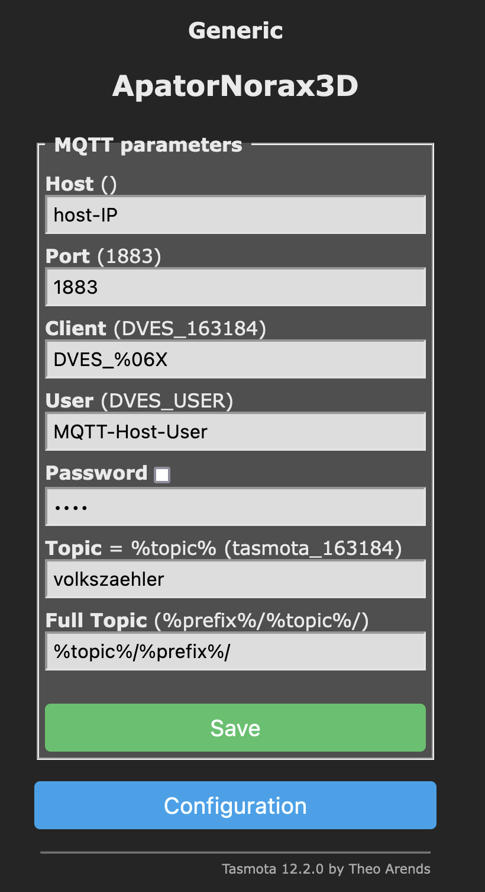

# IR Lesekopf für Stromzähler am ESP8266 mit Tasmota

[comment]: <> (This is a comment, it will not be included)
[//]: <> (This is also a comment.) 

### [zurück zum Hauptmenü](../../index.md)

IR Lesekopf für Stromzähler am ESP8266 mit Tasmota

Wie bekomme ich die Daten vom Stromzähler mit einem ESP8266 in mein OpenHAB eingebunden , um in Zusammenarbeit mit
der Balkon PV
den hausinternen Stromverbrauch zu optimieren ?
Na ja - die Voraussetzungen sind ja in den meisten Fällen durch den Einbau eines modernen SmartMeters, dh Stromzählers schon gegeben.
Mit Hilfe eines Lesekopfs können wir dann die Daten per Infrarot-Schnittstelle  vom Stromzähler auslesen und Richtung openHAB schicken.
Voraussetzung hierfür ist allerdings die Freischaltung des Stromzählers mit einer PIN, die ihr online bei eurem Netzbetreiber anfordern könnt.
Das geht schnell und einfach. Die notwendigen Schritte sind meistens je nach Stromzähler ebenfalls beim Netzbetreiber abrufbar.

Beim Lesekopf habe ich mich für den sog. Volkszähler entschieden, der sehr verbreitet ist und zu dem ihr sehr viele Anleitungen als
Videos und Blogs im Netz findet. Links füge ich  im weiteren Verlauf noch bei.

Es gibt eine Wifi Variante und eine ESP8266 Variante.
Bei der Wifi Variante sind sozusagen alle Komponenten als Einheit direkt im Lesekopf vorhanden.
Bei der TTL Variante müsst ihr den IR Lesekopf noch mit einer Steuerungseinheit, dem ESP verbinden und einige zusätzliche Arbeitsschritte selber durchführen .

Dazu erstmal ein paar grundsätzliche Worte zu Tasmota.

Tasmota ist eine Software , die auf einem Microcontroller wie zB dem D1 Mini,ESP8266 läuft . Diese Software kann man auf die Hardware , den ESP flashen.
Tasmota wird benötigt, damit der Lesekopf  mit dem Stromzähler kommunizieren kann.
Dafür könnte man sich eigentlich die Standard Release von Tasmota auf der Releasemanagement Seite

[Tasmota Github Repository](https://github.com/arendst/tasmota)

runterladen und mit einem Tool eigener Wahl auf den ESP flashen.
Das Problem ist allerdings, dass man die Funktionen / Kommandos für einen Smartmeter und speziell für deinen eingesetzten Smartmeter benötigt, 
diese aber im Standardrelease nicht enthalten sind.

[Tasmota Firmware Releases ](https://tasmota.github.io/docs/) 

<b>  Unter Features -> Smart Meter Interface </b>

[Tasmota SmartMeter Features ](https://tasmota.github.io/docs/Smart-Meter-Interface/)



Dh die bin enthalten nicht den nötigen Code um sich mit dem smartmeter zu verbinden und Funktionen auszuführen. 
Würden alle Funktionen in einem Standardrelease eingebunden, dann wäre der Speicherbedarf einfach zu groß, um es auf einem kleinen ESP im verfügbaren Flash 
Speicher unterzubringen.
Daher müssen wir uns eine eigene <i> bin </i> Datei zusammenstellen und compilieren. 
Dabei müssen die SML commands mit reincompiliert und in unseren Code eingebunden werden.

	Based on Tasmota's scripting language. 
	To use it you must compile your build. 
	Add the following to user_config_override.h:

	#ifndef USE_SCRIPT
	#define USE_SCRIPT
	#endif
	#ifndef USE_SML_M
	#define USE_SML_M
	#endif
	#ifdef USE_RULES
	#undef USE_RULES
	#endif

Auf der rechten Seite der Liste könnt ihr dann auch direkt nachschauen, ob euer SmartMeter in der Liste der bekannten Geräte
Enthalten ist. 

Jetzt geht es also daran , unser eigenes Tasmota System zu bauen und zu kompilieren.  Klingt dramatisch, bekommt aber 
jeder hin. Dafür brauchen wir erstmal den Quellcode von Tasmota.

Auf den link oben rechts auf der Tasmota Seite klicken , um auf die aktuellen Code Release Seiten zu kommen:

[Tasmota Release Pages ](https://github.com/arendst/tasmota)

Hier liegen alle möglichen Dateien, die nachher in unser binary kommen und somit kompiliert werden müssen.  
In dem development Branch könnt ihr sehen, dass  permanent Änderungen durchgeführt und aktualisiert werden. 
Die Einzelheiten zu dem Entwicklungszyklus von Tasmota will ich hier nicht weiter ausführen, dazu gibt es 
reichlich Material zum Lesen und sehr gute YouTube Videos.

Ihr solltet euch über die Tags die aktuelle Version raussuchen. 
Zum Zeitpunkt des Verfassers dieses Artikels ist dies die Version 12.2.0   

[Tasmota Aktuelle Release  ](https://github.com/arendst/Tasmota/tags)

 



Nun diese Release als zip Datei oder tar downloaden. Den kompletten Quellcode dann auf eurem System in ein Verzeichnis
entpacken. Achtet darauf , dass ihr auf einen freigegeben Release/Tag zurückgreift
Dann habt ihr den kompletten Tasmota Quellcode auf eurem System
Hier müsst ihr jetzt ein paar Dinge anpassen, um die SML Funktionen mit in den Quellcode einzubinden
Würdet ihr jetzt einfach nur einen compile+build durchführen, dann hättet ihr nichts gewonnen, sondern einfach nur ein
Standard Tasmota Release gebaut, die es auf den Tasmota Seiten auch direkt zum Download gibt.

Fügen wir also die zusätzlichen SML Features hinzu. Da wir dazu im Code Änderungen vornehmen  und eine neue Version
compilieren müssen, benötigen wir eine entsprechende Entwicklungsumgebung , eine sog. IDE . Hier gibt es wieder viele
Möglichkeiten, einige sind hier https://tasmota.github.io/docs/Compile-your-build/
beschrieben , zB 

	Visual Studio Code - setup and configure Visual Studio Code with PlatformIO for Tasmota

Da ich auf meinem MacBook sowieso Visual Studio Code installiert habe, 
zeige ich das weitere Vorgehen exemplarisch auf Basis dieser IDE.
Solltet ihr euch auch für diese Variante entscheiden, findet ihren einen kostenlosen 
Download der Software hier :  

[VisualStudio Code Download Page  ](hhttps://code.visualstudio.com/download)

Aber wie gesagt, mit Gitpod und Co gibt es auch weitere Alternativen.. 

In Visual Studio müsst ihr dann Platform.io als Plugin in VSCode installieren. 
Dazu ladet ihr euch die zusätzliche Software unter

[Platform.io Download Page  ](https://tasmota.github.io/docs/PlatformIO/)

auf euren Rechner und installiert das Ganze nach Anleitung wie auf der Seite beschrieben.

Platform.io hilft uns dann dabei, die fertigen binaries auf den ESP zu flashen. Nach der Installation könnt ihr links in VSCode
auf Extensions klicken und seht dann das Symbol der die Ameise für Platform.io. 

 

Danach wieder oben links auf 
	-> Explorer zurückgehen 
	-> Open Folder 
	-> in das Download Verzeichnis mit den Tasmota Dateien wechseln 
	-> und das Verzeichnis öffnen. 

Um zu sehen ob das alles funktioniert hat, 
	links auf die Ameise gehen -> default -> und auf Build all gehen . 

 

mitverfolgen. Wenn das alles funktioniert hat , solltet ihr dort

 

sehen

Jetzt geht es wieder zurück in die Dateiansicht und wir können endlich die Änderungen 
durchführen,  um unsere eigene Tasmota Version zu bauen.

Wie das geht , ist in der Doku unter 

	Smartmeter, Compile your own Build beschrieben

[Tasmota Firmware Compile-your-Build  ](https://tasmota.github.io/docs/Compile-your-build/)

Als Nächstes müssen die Zusätzlichen Funktionen aktiviert werden, indem die folgenden #defineCompiler-Anweisungsparameter hinzugefügt und dann die Firmware kompiliert werden. Die Parameter und die defines  
werden unter 

[Tasmota SmartMeter Interface  ](https://tasmota.github.io/docs/Smart-Meter-Interface/)

erläutert.

	#ifndef USE_SCRIPT
	#define USE_SCRIPT
	#endif
	#ifndef USE_SML_M
	#define USE_SML_M
	#endif
	#ifdef USE_RULES
	#undef USE_RULES
	#endif

Wie ihr seht, werden hier neben den SML auch die Script Funktionen aktiviert bzw. erweitert, 
da die Smartmeter Schnittstelle auf der Scriptsprache von Tasmota basiert.  

Zurück in VSCode Geht ihr wieder zum 
	-> Menüpunkt tasmota -> bis zu user_config-override.h . 

Dort könnt ihr auch weitere  Angaben machen und in eure binsaries einfügen, zB WLAN-ID 
und Passwort etc.  Wir fügen jetzt Also  unsere kopierten Zeilen unten ein und speichern 
das Ganze. 
Das sagt jetzt  der Projektdatei, „Bau mir mein binary mit den SML Erweiterungen“.
Jetzt wieder auf die Ameise klicken und 
	-> Build all

VSCode baut nun das Standard binary mit den Features, die wir eben hinzugefügt haben.
Anschließend  müssen wir das binary nur noch auf den ESP aufspielen (flashen).

Dazu gehe ich wieder auf den
	Explorer oben links 
und öffne ganz unten die Datei 
	Platforms-Override.ini 

Die hat VSCode automatisch angelegt, ansonsten müsstest du die sample-Datei selber
umbenennen und anpassen.
Hier können wir jetzt verschiedene Sachen konfigurieren. 
Da steht sehr viel drin, lasst euch dadurch aber nicht ablenken. 
Wir müssen hier nur den Upload-Port ändern, weil da steht als default sowas wie 

	 COM5

was zB auf einem Mac nicht passt. 
Welchen uploadport nutzen wir also ? 
Dazu öffnen wir ein Terminal und geben in der Shell

	ls -la /dev/cu.*

ein. 
Als Ausgabe seht ihr dann meine Standard Upload-Ports, die bei euch entsprechend andere 
Bezeichnungen haben

	% ls -la /dev/cu.*
	crw-rw-rw-  1 root  wheel  0x9000001 31 Okt 17:35 /dev/cu.Bluetooth-Incoming-Port

	

Ich schließe nun meinen D1 Mini  einfach mal an einen meiner USB-Ports von meinem MacBook. 
Anschliessend gebe ich wieder den Befehl 

	ls -la /dev/cu.*

ein und sehe jetzt den zugeordneten  usbserial-### Port . 

	% ls -la /dev/cu.*
	crw-rw-rw-  1 root  wheel  0x9000001 31 Okt 17:35 /dev/cu.Bluetooth-Incoming-Port
	crw-rw-rw-  1 root  wheel  0x9000003  9 Nov 11:16 /dev/cu.usbserial-2110

Diese Info füge ich anschliessend  in die Datei platformio.ini in der richtigen Zeile ein. 

	[common]
	platform 				= ${core.platform}
	platform_packages	= ${core.platform_packages}
	framework 			= arduino
	board				= esp8266_1M
	board_build.filesystem = littlefs
	custom_unpack_dir 	= unpacked_littlefs
	build_unflags 		= ${core.build_unflags}
	build_flags			= ${core.build_flags}
	monitor_speed		= 115200
	monitor_port			= /dev/cu.usbserial-2110
	; *** Upload Serial reset method for Wemos and NodeMCU
	upload_resetmethod	= nodemcu
	upload_port		= /dev/cu.usbserial-2110

 

Wir haben jetzt die Features hinzugefügt, das binary gebaut , so dass wir diese Firmware jetzt abschließend 
auf unseren ESP flashen können. 
Dazu einfach auf 
	Upload-all klicken 

und abwarten, bis der Vorgang erfolgreich abgeschlossen wurde.

Wenn das geklappt hat, ist unsere selbstgebaute Tasmota Firmware mit den zusätzlichen Funktionen gebaut 
und in den Speicher des ESPs kopiert. 

Womit wir dann auch mit diesem Abschnitt fertig sind. 

Konfiguration des ESPs

Wenn wir alles richtig gemacht und den ESP an Strom angeschlossen haben, 
sollten wir zB mit dem Smartphone ein neues WLAN finden, welches mit Tasmota_xxx anfängt. 
Denn der ESP ist momentan im sogenannten Access-Mode. Wir wechseln also in dieses WLAN 
und nach kurzer Zeit geht ein Konfigurationsfenster auf.

In diesem Konfigurationsdialog können wir nun erstmal die Zugangsdaten des eigenen WLANs eingeben, 
damit der ESP sich nach dem Neustart dort anmelden  kann. 

	Speichern -> neu starten -> Anzeige der IP Adresse, die ihr vom DHCP Server bekommen habt. 

Diese IP Adresse nehmen und in einem Browser aufrufen, so dass ihr in das Tasmota config Menü
kommt. 
Anschließend zuerst 
	 configuration-Modul = generic -> Speichern.

Wenn ihr erstmal testen wollt, ob eure SML Funktionen auch in dem binary eingebaut  wurden, könnt ihr auf 

	Console-> edit Script gehen 

wo ihr ein Script einfügen könnt.

Hier solltet ihr jetzt euren Zähler konfigurieren. In meinem Fall ist das ein Apator NORAX 3D 
Hier gebe ich an, welche Daten ich denn auf welche Art und Weise bekomme und wie ich die abfragen will. 
All das wird in dem Script beschrieben.
Was schreibe also hier rein ? 

Dafür Wechsel ich wieder auf die Tasmota Seite unter 

	Features-> smartmeter-Interface 

und hier findest du hoffentlich deinen Stromzähler. 

[Tasmota SmartMeter Script  ](https://tasmota.github.io/docs/Smart-Meter-Interface/#norax-3d-sml)

In meinem Fall ist der NORAX3D aufgeführt und dort finde ich das passende  Script. 

	Norax 3D+ (SML)~
	This script gives also the wattage per phase. Make sure to get the PIN from your grid operator! 
	Tested on a WeMos D1 mini with an IR Head from https://agalakhov.github.io/ir-interface connected to the RX pin (3). 
	The meter also outputs the phase angles, but i left them out since i do not need them. 
	You can easily find additional values by activating the debug mode ("sensor53 d1" for the first meter, 
	switch off after a few seconds with "sensor53 d0").

	>D
	>B
	->sensor53 r
	>M 1
	+1,3,s,1,9600,SML
	1,77070100010800ff@1000,Total consumption,KWh,Total_in,4
	1,77070100020800ff@1000,Total Feed,KWh,Total_out,4
	1,77070100100700ff@1,Current consumption,W,Power_curr,0
	1,77070100200700ff@1,Voltage L1,V,Volt_p1,1
	1,77070100340700ff@1,Voltage L2,V,Volt_p2,1
	1,77070100480700ff@1,Voltage L3,V,Volt_p3,1
	1,770701001f0700ff@1,Amperage L1,A,Amperage_p1,1
	1,77070100330700ff@1,Amperage L2,A,Amperage_p2,1
	1,77070100470700ff@1,Amperage L3,A,Amperage_p3,1
	1,77070100240700ff@1,Current consumption L1,W,Power_curr_p1,0
	1,77070100380700ff@1,Current consumption L2,W,Power_curr_p2,0
	1,770701004c0700ff@1,Current consumption L3,W,Power_curr_p3,0
	1,770701000e0700ff@1,Frequency,Hz,frequency,0

Diese Info also von der Seite kopieren -> Wechsel zurück zur Tasmota Konfiguration ->  die Scriptdaten unter 
	<b> edit-script </b> 

 

einfügen und das Ganze mit dem Häkchen oben links aktivieren.
Nicht vergessen ! - das wird oftmals übersehen.

 

Auf der Tasmota Seite findet ihr noch ausführliche  Erklärungen, was mit dem script dann an 
Funktionen bereitgestellt wird:

[Tasmota SmartMeter Script Funktionen  ](https://tasmota.github.io/docs/Smart-Meter-Interface/)

Wenn das geklappt hat, dann solltet ihr im 
	Main Menü 
die entsprechenden Werte sehen.

Damit das Ganze funktioniert, müsst ihr euch allerdings vom Netzbetreiber den PIN für die Freischaltung des Zählers 
geben lassen. Das geht sehr einfach über ein Online Formular und der PIN wird dann aus Sicherheitsgründen per Post 
zu euch geschickt. Das dauert ein paar Tage, hat aber in meinem Fall schnell und reibungslos funktioniert. 

Je nachdem welche Werte euch der Zähler liefert , könnt ihr das Script anpassen und Zeilen 
rauslöschen, weil zB  nicht jede einzelne Phase als Wert geliefert wird oder geliefert werden soll etc.
Das Ganze ist recht einfach, weil alle Details gut dokumentiert sind. Ich hoffe also, dass auch 
euer Zähler mit in der Liste der Smartmeter enthalten ist.

All diese Werte kann ich jetzt wieder per MQTT an einen MQTT Host weiterleiten, zB an meine OpenHAB 
SmartHome Zentrale . 
Hierzu in Tasmota 
	MainMenü -> Configuration -> MQTT die entsprechenden Konfigurationen vornehmen.

 

Bezüglich der MQTT Konfiguration noch ein kurzer Ausflug in die Tasmota Eigenschaften, die hier berücksichtigt werden sollten:

[https://tasmota.github.io/docs/MQTT/ ](https://tasmota.github.io/docs/MQTT/#examples)

	For a basic setup you only need to set Host, User and Password but it is recommended to change Topic to avoid issues. Each device should have a unique Topic.
    * Host = your MQTT broker address or IP (mDNS is not available in the official Tasmota builds, means no .local domain!)
    * Port = your MQTT broker port (default port is set to 1883)
    * Client = device's unique identifier. In 99% of cases it's okay to leave it as is, however some Cloud-based MQTT brokers require a ClientID connected to your account. Can not be identical to Topic!
    * User = username for authenticating on your MQTT broker
    * Password = password for authenticating on your MQTT broker
    * Topic = unique identifying topic for your device (e.g. hallswitch, kitchen-light). %topic% in wiki references to this. It is recommended to use a single word for the topic.
    * FullTopic = full topic definition. Modify it if you want to use multi-level topics for your devices, for example lights/%prefix%/%topic%/ or %prefix%/top_floor/bathroom/%topic%/ etc.

FullTopic ist das MQTT-Topic, das für die Kommunikation mit Tasmota über MQTT verwendet wird. 
Es wird mit Hilfe von Token erstellt, die in einer benutzerdefinierten Zeichenkette (mit maximal 100 Zeichen) platziert werden. 
Die Token werden während der Laufzeit dynamisch ersetzt. 
Damit die MQTT Anbindung korrekt funktioniert , muss das FullTopic die beiden Variablen %prefix% und %topic% enthalten 

Die Variable %prefix% enthält wahlweise tele, cmnd oder stat, je nachdem, welchen Teil Tasmota gerade anspricht.
Die drei Zweige cmnd, tele und stat haben in Tamota ganz klar definierte Funktionen:
	- cmnd ist zum Senden von Befehlen in Richtung Tasmota gedacht. Das entspricht der Eingabe in der Tasmota Kommandozeile.
	- stat liefert unmittelbare "Antworten" auf empfangene Kommandos. Nehmen wir das Standard FullTopic und das Topic "device" als Beispiel, dann kann man eine Schaltsteckdose mit cmnd/device/POWER ON dazu bewegen, die Steckdose einzuschalten. Gleichzeitig wird Tasmota mit stat/device/POWER ON und stat/device/RESULT {"Power":"ON"} reagieren.
	- Über tele werden zyklisch Daten gesendet.

Alle MQTT-Statusmeldungen werden unter Verwendung des konfigurierbaren %topic% gesendet, das vom Benutzer eindeutig festgelegt werden muss. 
In diesem Projekt heisst das topic = „volkszaehler“,  kann aber auch „tasmota-xyz-abc“ heissen , solange man weiß, was es ist und wo es zu finden ist.
Im Topic vergibt man einen eindeutigen Namen, oder zumindest einen im Rahmen des Fulltopics eindeutigen Namen. 
Auch hier könnte man noch Unterebenen definieren, es erscheint aber sinnvoll, es damit nicht zu übertreiben 

Nachdem ihr die Konfiguration abgespeichert habt, könnt ihr in den Konsolen messages zB folgende Messages sehen:

	volkszaehler/tele/SENSOR = {"Time":"2022-11-11T11:11:11“,“SML":{"Power_curr“:000}}
Oder (gekürzt)
	volkszaehler/tele/STATE = {"Time“:“2022-11-11T11:11:11“,“Uptime":"","UptimeSec““:,“Heap“:““SleepMode":"Dynamic","Sleep““,“LoadAvg“:““MqttCount“:““Wifi":{"AP":1,"SSId“:“““x:“““,“Channel““,“Mode“:“““,“RSSI“““Signal““LinkCount“““:““}}
Oder (gekürzt)
	volkszaehler/tele/SENSOR = {"Time“:“2022-11-11T11:11:11“,“SML":{"Total_in““Total_out““Power_curr“:““Volt_p1":,"Volt_p2":,"Volt_p3":,"Amperage_p1","Amperage_p2":,"Amperage_p3","Power_curr_p1":0,"Power_curr_p2":0,"Power_curr_p3":0,"frequency":50}}

Was die Konfiguration auf der Gegenseite , dh OpenHAB betrifft, hier auch noch ein paar Hinweise, die zum besseren Verständnis hilfreich sind.
Hier gilt mein Dank den fleissigen Erklärungen auf [openhabforum ](https://openhabforum.de/)

Tasmota != mqtt != generic mqtt Thing. 

In Tasmota gibt es drei Prefixes, d.h. für Commands, Status und zyklische Statusinfo -  und die Senderichtung ist zweigeteilt. 
In MQTT gibt es nur zwei Richtungen, 
- vom Client zum Broker und 
- vom Broker zum Client. 

Die Topics, welche zum Client gehen, werden vom Client abonniert.
Die Topics, über die der Client sendet, werden vom Client (gewöhnlich) nicht abonniert. 

In openHAB wird MQTT abgebildet, kein Tasmota ! 
Es gibt also Topics zum Senden und Topics zum empfangen. 

Die Empfangsrichtung wird über das stateTopic konfiguriert, die Senderichtung über das commandTopic. 
Wenn ein Channel nur senden soll, wird kein stateTopic konfiguriert, wenn ein Channel nur empfangen soll, wird kein commandTopic konfiguriert. 

Der mit der eigenen Tasmota-Firmware geflashte ESP kann jetzt Daten vom Stromzähler per MQTT an 
OpenHAB senden. Allerdings ist an meinen ESP ja derzeit noch kein Lesekopf angebunden. Das wäre dann
der nächste Schritt.

Der Volkszähler Lesekopf 

Nach etwas Suche bin ich auf eine weit verbreitete Variante gestossen:

[ebay-link: TTR IR Lesekopf Lese-Schreib-Kopf EHZ Volkszähler Original-Hichi Smartmeter ](
https://www.ebay.de/itm/314015465828?_trkparms=amclksrc%3DITM%26aid%3D1110006%26algo%3DHOMESPLICE.SIM%26ao%3D1%26asc%3D242766%26meid%3D34b44eb109e34cc3b43298d06e1fc4b8%26pid%3D101195%26rk%3D1%26rkt%3D12%26sd%3D314152997777%26itm%3D314015465828%26pmt%3D1%26noa%3D0%26pg%3D2047675%26algv%3DSimplAMLv11WebTrimmedV3MskuAspectsV202110NoVariantSeedKnnRecallV1&_trksid=p2047675.c101195.m1851&amdata=cksum%3A31401546582834b44eb109e34cc3b43298d06e1fc4b8%7Cenc%3AAQAHAAABIMFr2e4EmAnM%252ByHZkULYKDIJ4L66fOjNL0iupgt%252BzO1%252F3AE1t3mNirUYB96NktMCicMagiS6mbeTl0xquGODv9nSajpm1aaEbsSFw0uTVvCdFa4SbTTTejhdIALH%252FMfICFmn9uxcclDxbM5y0r8z4myyvxKikwjz5jwlJAw6hlp5di%252BCZ3FC5B8BnS6VuoSzmejpuqpezh2l0g3lUGIw5ENGdD0xE19uE%252BqGTt2GsHa59UBPO%252FmSiOGQGHyfpNfF8iHoEeax%252FVso5CxW%252FCTFlzilaKSnOya31INXwB6%252B0fz5t1f4NiGPY52y27aNEXhGpWSLr%252FahPOyEy6qzYpvqeXp0%252B84C9ZiKywRw6olNBsqNvwC2weP8w3zDAxKii%252FP%252BSw%253D%253D%7Campid%3APL_CLK%7Cclp%3A2047675)

    * ausgereifte und verbreitete Platine mit Schmitt Triggern zum sicheren und störungsfreien Betrieb
    * Baudraten bis 57600 sind möglich und getestet.
    * TTL Version (RX / TX)
    * 3,3V - 5V Betriebsspannung
    * geeignet für Arduino, ESP8266, ESP32, Raspberry und alles was eine UART Schnittstelle hat
    * Platine beschriftet VCC GND RX TX
    * Lesen und senden (manche Zähler müssen zum Senden aufgefordert werden, funktioniert nicht mit einem reinem Lesekopf, mit diesem kein Problem)

Das Ganze gibt es auch direkt als WLAN Modell, was euch den ganzen Aufwand eines eigenen Tasmota builds erspart.  

[Wiki: ir-schreib-lesekopf-ttl-ausgang](https://wiki.volkszaehler.org/hardware/controllers/ir-schreib-lesekopf-ttl-ausgang)

IR-Schreib-Lesekopf, TTL-Interface
Hier der IR-Schreib-Lesekopf mit TTL-Ausgang.
Features
- Alle Funktionen auf einer einseitigen Leiterplatte.
- Gesteigerte IR-Empfangsempfindlichkeit.

In meinem Fall verbinde ich den Lesekopf jetzt mit dem ESP:

 

Ein „Trockentest“ des Lesekopfs hat bei mir mit einer Brücke auf Rx-Tx nicht funktioniert. 
Also habe ich den Lesekopf direkt am Stromzähler positioniert und siehe da - es funktionierte auf Anhieb, 
dh der Lesekopf sendet Daten an den ESP

Telemetry period

In den Consolen Messages seht ihr , welche Daten auf welchem Topic in welchem Intervall an den MQTT Host 
gesendet werden.
Die Auslesefrequenz war default bei mir im Minutenbereich, was insbesondere dann wenig Sinn macht, wenn ich 
die aktuelle PV Leistung möglichst optimal an der Grundlast verbrauchen will. 
Dh habe ich mehr PV Leistung als Grundlast, dann schalte ich zusätzliche Verbraucher ein, zB Stromspeicher. 
(Powerbanks, Notebooks, ebikes etc). 
Der Grund hierfür liegt sehr einfach darin, dass es für Balkonkraftwerke bis 600W Einspeisung zwar ein vereinfachtes
 Genehmigungsverfahren gibt, dafür allerdings auch keine Einspeisevergütung. 
Daher müsst ihr auch unbedingt darauf achten, dass eurer Stromzähler bei Einspeisung nicht rückwärts läuft, 
was vorallem bei den ganz alten Drehstromzählern meistens der Fall ist. 
Egal, der entscheidende Punkt ist, ihr verschenkt Strom und damit Geld, wenn ihr den erzeugten Strom nicht bestmöglich 
im Hausnetz verbraucht. 

Aus diesem Grund habe ich die Polling-Period für curr_Power im Script auf 16 gesetzt, dh Sekundentakt. 

	1,77070100100700ff@1,Current consumption,W,Power_curr,16

Genauere Erläuterungen zu diesem und anderen Parametern findet ihr hier:

[SML-auslesen-mit-Tasmota](https://forum.creationx.de/forum/index.php?thread/1095-d0-z%C3%A4hler-sml-auslesen-mit-tasmota/&postID=40311#post40311)

[Telemetry period](https://tasmota.github.io/docs/Commands/)

	TelePeriod
	See current value and force publish STATE and SENSOR message
	0 = disable telemetry messages
	1 = reset telemetry period to firmware default (TELE_PERIOD)
	10..3600 = set telemetry period in seconds (default = 300)

OpenHAB 

Auf der Empfängerseite (OpenHAB) müssen jetzt die topics mittels GenericMQTT Things+Items angelegt werden. Diese Schritte habe ich in meinen 
anderen Projekten bereits beschrieben, so dass ihr die einzelnen Schritte dort nochmal nachlesen könnt.

Per rules lese ich dann mit Hilfe von JSONPath die gewünschte Info , wie zB curr_Power aus und aktualisiere die Sitemap.

volkszaehler.rules

	// **************************************************************************************************************************
	//      Volkszaehler mit dem ESP MQTT string auslesen per JSONPATH
	//      {"Time":"2022-11-06T13:28:10","SML":{"Power_curr":110}} to {"Time":"2022-11-06T13:28:11","SML":{"Power_curr":112}}
	// **************************************************************************************************************************
	rule "volkszaehler Sensor Data"
	when
	  Item GenericMQTTThing_volkszaehlerData changed
	then
	  val mqttActions = getActions("mqtt","mqtt:broker:BROKER-ID")
	  var String temp = transform("JSONPATH", "$.SML.Power_curr", GenericMQTTThing_volkszaehlerData.state.toString)
	  logInfo("  VOLKSZAEHLER  String :    --->>> ", temp)
          postUpdate(HausGesamtStrom,temp)
	end

meine.sitemaps

Der angezeigte HausGesamtStrom zeigt die Summe des Gesamtverbrauchs, dh am Stromzähler wird die Einspeisung 
Von der Balkon-PV Anlage eingerechnet. Bei viel Sonne und wenig Grundlast im Haus kann der Wert also auch negativ werden.
Dann nutzt ihr sozusagen nur grünen Strom.

	Text item=HausGesamtStrom       label=" Strom Grundlast aktuell " valuecolor=[<0="green" , >1="red"] icon="energy"

Soweit erstmal das kurze Tutorial , wie man sich eine eigene Firmware für den ESP baut und diese dann mit einem IR Lesekopf
verbindet, die Daten in seine SmartHome Zentrale bekommt und verarbeitet. 
All diese Informationen findet ihr natürlich vielfach auf YouTube,  in Foren etc , die ganz hervorragend und hilfreich sind.
Aber das komplette end-to-end Szenario für meinen Bedarf gab es in der passenden Form nicht, so dass ich die Einzelschritte
für mich , aber auch für andere Interessierte dokumentiert habe. 

Anmerkungen, Kritik, Hinweise sind immer willkommen. 

n1028fh@gmail.com

Ansonsten hoffe ich, dass diese Anleitung dem ein oder anderen schneller zum Ziel hilft. 

